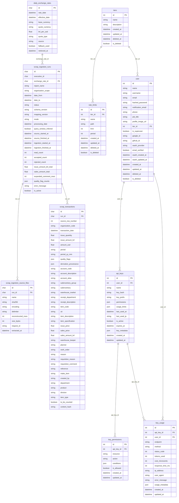

# Database Entity-Relationship Diagram (ERD)

> Generated automatically from SQLAlchemy models.

```mermaid
erDiagram
    api_keys {
        int id "PK"
        int user_id "FK"
        string name
        string key_hash
        string key_prefix
        json permissions
        json usage_limits
        datetime last_used_at
        string last_used_ip
        boolean is_active
        datetime expires_at
        json key_metadata
        datetime created_at
        datetime updated_at
    }

    daily_exchange_rates {
        char id "PK"
        datetime rate_date
        datetime effective_date
        string base_currency
        string quote_currency
        float brl_per_usd
        string quote_type
        string source
        boolean fallback_used
        datetime retrieved_at
    }

    key_permissions {
        int id "PK"
        int api_key_id "FK"
        string resource
        string action
        json conditions
        boolean is_allowed
        datetime created_at
        datetime updated_at
    }

    key_usage {
        int id "PK"
        int api_key_id "FK"
        int user_id "FK"
        string endpoint
        string method
        int status_code
        int tokens_used
        int cost_microcents
        int response_time_ms
        string ip_address
        string user_agent
        string error_message
        json usage_metadata
        datetime created_at
        datetime updated_at
    }

    rate_limits {
        int id "PK"
        int tier_id "FK"
        string name
        string path
        int limit
        int period
        datetime created_at
        datetime updated_at
        datetime deleted_at
        boolean is_deleted
    }

    scrap_ingestion_runs {
        char id "PK"
        char execution_id
        char exchange_rate_id "FK"
        string report_name
        string organization_scope
        datetime date_from
        datetime date_to
        string status
        string schema_version
        string mapping_version
        string mode
        datetime processing_date
        boolean query_window_inferred
        datetime source_started_at
        datetime source_finished_at
        datetime ingestion_started_at
        datetime ingestion_finished_at
        int read_count
        int accepted_count
        int rejected_count
        float issue_amount_brl_total
        float sales_amount_total
        int expanded_comment_rows
        json quality_flag_counts
        string error_message
        boolean is_active
    }

    scrap_ingestion_source_files {
        char id "PK"
        char run_id "FK"
        string name
        string sha256
        string encoding
        string delimiter
        int reconstructed_rows
        int size_bytes
        string request_id
        datetime extracted_at
    }

    scrap_transactions {
        char id "PK"
        char run_id "FK"
        int source_row_number
        string organization_code
        datetime transaction_date
        float issue_quantity
        float issue_amount_brl
        float amount_usd
        string period
        string period_yy_mm
        json quality_flags
        json derivation_provenance
        string account_code
        string account_description
        string account_alias
        string subinventory_group
        string subinventory
        string warehouse_market
        string receipt_department
        string receipt_description
        string item_code
        string uit
        string item_description
        string item_specification
        float issue_price
        float sales_price
        float sales_amount_brl
        string warehouse_keeper
        string planner
        string work_order
        string reason
        string requisition_reason
        string requisition_comment
        string reference
        string make_item
        string created_by
        string department
        string product
        string division
        string item_type
        boolean to_be_counted
        string content_hash
    }

    tiers {
        int id "PK"
        string name
        string description
        datetime created_at
        datetime updated_at
        datetime deleted_at
        boolean is_deleted
    }

    user {
        int id "PK"
        string name
        string username
        string email
        string hashed_password
        string notification_email
        string phone
        string job_title
        string profile_image_url
        int tier_id "FK"
        boolean is_superuser
        string google_id
        string github_id
        string oauth_provider
        boolean email_verified
        datetime oauth_created_at
        datetime oauth_updated_at
        datetime created_at
        datetime updated_at
        datetime deleted_at
        boolean is_deleted
    }

    %% Relationships
    user ||--o{ api_keys : "user_id"
    api_keys ||--o{ key_permissions : "api_key_id"
    api_keys ||--o{ key_usage : "api_key_id"
    user ||--o{ key_usage : "user_id"
    tiers ||--o{ rate_limits : "tier_id"
    daily_exchange_rates ||--o{ scrap_ingestion_runs : "exchange_rate_id"
    scrap_ingestion_runs ||--o{ scrap_ingestion_source_files : "run_id"
    scrap_ingestion_runs ||--o{ scrap_transactions : "run_id"
    tiers ||--o{ user : "tier_id"
```
