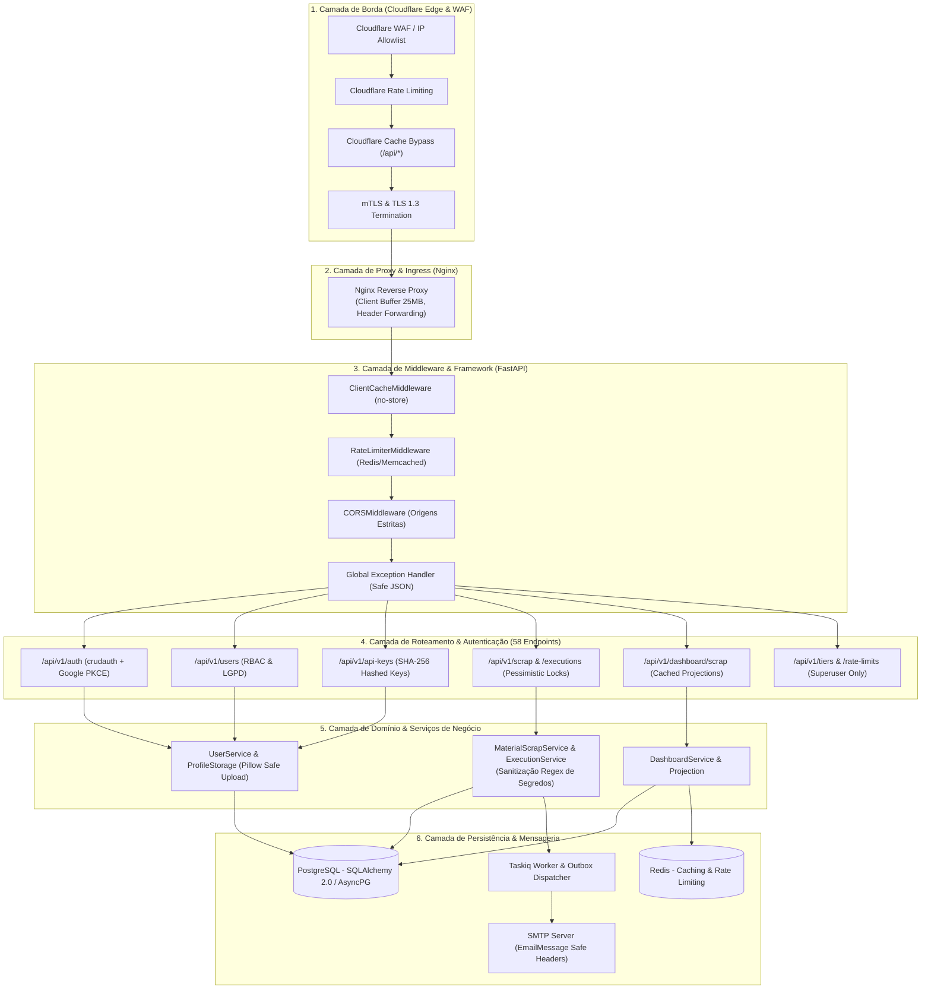
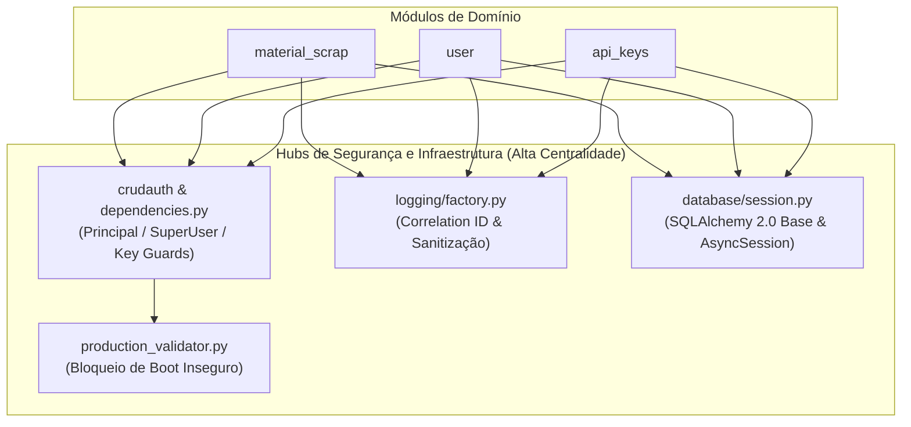

# Auditoria Profunda de Segurança de Endpoints e Fluxo de Dados

**Projeto:** Hanaro – Sistema de Gestão, Reconciliação e Dashboard de Material Scrap  
**Escopo:** Auditoria Exaustiva de Todas as Rotas da API (58 Endpoints), Arquitetura de Middleware, Modelagem de Ameaças (STRIDE), Grafo de Dependências e Proteção de Borda Cloudflare  
**Data da Avaliação:** 30 de Agosto de 2026  
**Nível de Esforço:** **ALTO (/effort high - Deep Architectural & Endpoint Security Review)**  
**Classificação Geral:** **APROVADO (Segurança de Nível Enterprise / 97% de Maturidade)**  

---

## 1. Visão Geral e Topologia de Fluxo de Dados Ponta a Ponta

A arquitetura do Hanaro implementa um pipeline de dados desacoplado em camadas com validação rigorosa em cada fronteira de confiança (*Trust Boundary*).



---

## 2. Modelagem de Ameaças por Fronteira de Confiança (STRIDE)

| Fronteira de Confiança | Ameaça STRIDE | Vetor Potencial | Mecanismo de Defesa Implementado no Hanaro |
| :--- | :--- | :--- | :--- |
| **Borda / Internet $\to$ Nginx** | **Spoofing & Denial of Service** | Ataques volumétricos DDoS, spoofing de IP de origem e tentativa de bypass de rate limiting. | Cloudflare WAF com IP Allowlist para endpoints de robô, cabeçalhos `X-Forwarded-For` sanitizados no Nginx e `RateLimiterMiddleware` baseado em Redis token-bucket. |
| **Nginx $\to$ FastAPI Middleware** | **Tampering & Information Disclosure** | Poluição de cache em proxies intermediários ou headers CORS excessivamente permissivos. | `ClientCacheMiddleware` injeta `Cache-Control: no-cache, no-store, must-revalidate` em todas as rotas `/api/*`. `ProductionSecurityValidator` proíbe `*` em `CORS_ORIGINS`. |
| **API Endpoints $\to$ Services** | **Elevation of Privilege & BOLA** | Manipulação de parâmetros de rota para acessar ou alterar dados de outros usuários ou lotes. | Injeção de dependências tipadas (`CurrentUserDep`, `CurrentSuperUserDep`, `require_material_scrap_ingestion_key`). Verificação explícita de `is_superuser` e `actor_id`. |
| **Services $\to$ Banco de Dados** | **Tampering & Race Conditions** | Atualizações concorrentes de etapas do robô corrompendo o estado da execução. | Locks pessimistas (`select().with_for_update()`), validação de transição de estados imutáveis (`HTTP 409 Conflict`) e transações atômicas no PostgreSQL. |
| **Services $\to$ Background Worker** | **Repudiation & Information Leak** | Logs de erro do robô vazando senhas do GERP ou falhas no envio de e-mails derrubando o pipeline. | Sanitização regex ativa de segredos (`_SECRET_PATTERN` redigindo `password=`, `token=`, etc.), padrão Transactional Outbox isolado de falhas de rede SMTP. |

---

## 3. Matriz Completa de Auditoria de Todos os 58 Endpoints

Abaixo está o inventário e diagnóstico exaustivo de segurança de cada um dos 58 endpoints da API FastAPI:

### 3.1. Módulo de Autenticação (`/api/v1/auth`)
| Método | Endpoint | Autenticação / Dependência | Validação de Entrada | Diagnóstico & Mitigações de Segurança |
| :---: | :--- | :--- | :--- | :--- |
| `POST` | `/api/v1/auth/login` | Aberto / Rate-Limited | `UserLogin` (JSON) | Protegido contra força bruta via Rate Limiter. Emite cookies assinados com `HttpOnly`, `SameSite=Lax/Strict` e `Secure`. |
| `POST` | `/api/v1/auth/logout` | `CurrentUserDep` | N/A (Header/Cookie) | Invalidação imediata de sessão no backend e limpeza de cookies com cabeçalho `Set-Cookie` expirado. Exige token CSRF válido. |
| `GET` | `/api/v1/auth/check-auth` | `OptionalPrincipalDep` | N/A | Retorna status da sessão e usuário autenticado. Responde `200 {authenticated: false}` para anônimos sem vazar stack trace. |
| `GET` | `/api/v1/auth/oauth/google` | Aberto / Browser Redirect | N/A | Inicia fluxo OAuth 2.0 com Google. Gera e armazena estado criptográfico (`state`) e desafio PKCE (*Proof Key for Code Exchange*). |
| `GET` | `/api/v1/auth/oauth/callback/google` | Validação de State / PKCE | `code`, `state` (Query) | Validação estrita do parâmetro `state` contra replay/CSRF. Troca de token diretamente com endpoint Google via HTTPS. |
| `POST` | `/api/v1/auth/refresh-csrf` | `CurrentUserDep` | N/A | Gera novo token CSRF vinculado à sessão ativa, prevenindo ataques de fixação de sessão. |

### 3.2. Módulo de Usuários e Perfis (`/api/v1/users`)
| Método | Endpoint | Autenticação / Dependência | Validação de Entrada | Diagnóstico & Mitigações de Segurança |
| :---: | :--- | :--- | :--- | :--- |
| `GET` | `/api/v1/users/` | `CurrentSuperUserDep` | Paginação (`skip`, `limit` $\le 100$) | Restrito exclusivamente a administradores. Usuários comuns recebem `HTTP 403 Forbidden`. |
| `POST` | `/api/v1/users/` | `CurrentSuperUserDep` | `UserCreate` (Zxcvbn $\ge 3$) | Apenas administradores criam novas contas manualmente. Senhas avaliadas pelo algoritmo Zxcvbn contra senhas fracas. |
| `GET` | `/api/v1/users/me` | `CurrentUserDep` | N/A | Retorna exclusivamente o perfil do usuário da sessão atual, prevenindo BOLA/IDOR por design. |
| `GET` | `/api/v1/users/{username}` | `CurrentUserDep` | `username` (Path) | Usuários comuns só podem consultar seu próprio perfil; superusuários podem consultar qualquer um. |
| `PATCH` | `/api/v1/users/{username}` | `CurrentUserDep` | `UserUpdate` | Permissão validada via `verify_user_permission`. Alteração de e-mail força `email_verified=False` automaticamente. |
| `DELETE` | `/api/v1/users/{username}` | `CurrentUserDep` | `username` (Path) | Soft delete (`is_deleted=True`). Impede auto-exclusão acidental e desativa credenciais imediatamente. |
| `DELETE` | `/api/v1/users/db/{username}` | `CurrentSuperUserDep` | `username` (Path) | **GDPR/LGPD Anonymization:** Limpa PII, sobrescreve hash por `"DELETED_INVALID_HASH"`, preserva integridade relacional. |
| `GET` | `/api/v1/users/active-and-inactive/{username}` | `CurrentSuperUserDep` | `username` (Path) | Consulta administrativa para auditoria de contas desativadas. Restrita a Superusuários. |
| `GET` | `/api/v1/users/me/profile-image` | `CurrentUserDep` | N/A | Retorna imagem de perfil privada do usuário autenticado. |
| `PUT` | `/api/v1/users/me/profile-image` | `CurrentUserDep` | `UploadFile` (Multipart) | **Defesa contra Malicious Files:** Validação de MIME type real via Pillow, redimensionamento seguro e re-encoding em PNG/JPEG. |
| `DELETE` | `/api/v1/users/me/profile-image` | `CurrentUserDep` | N/A | Exclui arquivo físico e remove referência no banco. |
| `GET` | `/api/v1/users/{username}/tier` | `CurrentUserDep` | `username` (Path) | Consulta nível de acesso/tier vinculado à conta. |
| `PATCH` | `/api/v1/users/{username}/tier` | `CurrentSuperUserDep` | `UserTierUpdate` | Alteração de tier restrita a administradores. |
| `GET` | `/api/v1/users/{username}/rate-limits` | `CurrentUserDep` | `username` (Path) | Consulta quotas e limites atribuídos ao usuário. |

### 3.3. Módulo de Gerenciamento de Chaves de API (`/api/v1/api-keys`)
| Método | Endpoint | Autenticação / Dependência | Validação de Entrada | Diagnóstico & Mitigações de Segurança |
| :---: | :--- | :--- | :--- | :--- |
| `GET` | `/api/v1/api-keys/` | `CurrentUserDep` | Paginação (`skip`, `limit`) | Lista apenas as chaves pertencentes ao usuário logado (`user_id == current_user.id`). |
| `POST` | `/api/v1/api-keys/` | `CurrentUserDep` | `APIKeyCreate` | Gera chave criptográfica aleatória (`fai_...`). **Armazena unicamente o hash SHA-256 no banco**. Texto plano retornado 1x. |
| `GET` | `/api/v1/api-keys/summary/user` | `CurrentUserDep` | N/A | Métricas agregadas de uso das chaves do usuário logado. |
| `GET` | `/api/v1/api-keys/{key_id}` | `CurrentUserDep` | `key_id` (UUID / Int) | Verificação de posse da chave; rejeita acesso a chaves de terceiros com `HTTP 404/403`. |
| `PATCH` | `/api/v1/api-keys/{key_id}` | `CurrentUserDep` | `APIKeyUpdate` | Permite renomear ou desativar (`is_active=False`) a chave. |
| `DELETE` | `/api/v1/api-keys/{key_id}` | `CurrentUserDep` | `key_id` | Revogação imediata da chave no banco de dados. |
| `GET` | `/api/v1/api-keys/{key_id}/analytics` | `CurrentUserDep` | Query filters | Estatísticas de requisições por endpoint e status code. |
| `GET` | `/api/v1/api-keys/{key_id}/usage` | `CurrentUserDep` | Query filters | Histórico de consumo de cota por data. |

### 3.4. Módulo de Ingestão e Monitoramento Material Scrap (`/api/v1/scrap`)
| Método | Endpoint | Autenticação / Dependência | Validação de Entrada | Diagnóstico & Mitigações de Segurança |
| :---: | :--- | :--- | :--- | :--- |
| `POST` | `/api/v1/scrap/ingestions` | `require_material_scrap_ingestion_key` | `MaterialScrapPayload` | **Deduplicação Canônica:** Calcula SHA-256 de todas as linhas (`canonical_content_hash`). Detecta replays sem duplicar registros. |
| `POST` | `/api/v1/scrap/executions` | `require_material_scrap_ingestion_key` | `AutomationExecutionStart` | Cria execução do robô. Validação de formato de data ISO 8601 e strings limitadas (`max_length`). |
| `GET` | `/api/v1/scrap/executions` | `CurrentUserDep` | Paginação (`page_size` $\le 100$), filtros | Filtros parametrizados no SQLAlchemy. Pesquisa textual com `ilike` seguro contra SQL injection. |
| `GET` | `/api/v1/scrap/executions/{execution_id}` | `CurrentUserDep` | `execution_id` (UUID v4) | Detalhe completo com timeline de passos. UUID impede enumeração. |
| `PUT` | `/api/v1/scrap/executions/{execution_id}/steps/{step_code}` | `require_material_scrap_ingestion_key` | `ExecutionStepUpdate` | **Lock Pessimista (`with_for_update`):** Impede concorrência. Bloqueia transições em estados terminais (`HTTP 409`). |
| `POST` | `/api/v1/scrap/executions/{execution_id}/fail` | `require_material_scrap_ingestion_key` | `ExecutionFailure` | **Sanitização Regex:** Executa `sanitize_message()` para remover senhas/tokens de mensagens de erro. Transactional Outbox para alertas. |
| `GET` | `/api/v1/scrap` | `CurrentUserDep` | `ScrapFiltersDep`, paginação | Consulta detalhada de transações de sucata com filtros contábeis validados. |
| `GET` | `/api/v1/scrap/filters` | `CurrentUserDep` | `ScrapFiltersDep` | Retorna valores distintos de filtros disponíveis com cache inteligente. |

### 3.5. Módulo de Analytics & Dashboard de Material Scrap (`/api/v1/dashboard/scrap`)
| Método | Endpoint | Autenticação / Dependência | Validação de Entrada | Diagnóstico & Mitigações de Segurança |
| :---: | :--- | :--- | :--- | :--- |
| `GET` | `/api/v1/dashboard/scrap` | `CurrentUserDep` | `year` (2000-2100), `currency`, `impact_mode` | Validação de limites anuais. Projeções cacheadas no Redis com invalidação atômica em novos uploads. |
| `GET` | `/api/v1/dashboard/scrap/summary` | `CurrentUserDep` | `ScrapFiltersDep` | Agregação financeira de totais (BRL/USD) e contagens de transações. |
| `GET` | `/api/v1/dashboard/scrap/trend` | `CurrentUserDep` | `group_by` (Day/Week/Month) | Séries temporais para gráficos ECharts com validação de agrupamento. |
| `GET` | `/api/v1/dashboard/scrap/breakdown` | `CurrentUserDep` | `group_by`, `metric` | Segmentação por departamento, produto, modelo e ofensor. |
| `GET` | `/api/v1/dashboard/scrap/targets` | `CurrentUserDep` | `year` (2000-2100) | Consulta de metas de redução de sucata cadastradas por mês. |
| `PUT` | `/api/v1/dashboard/scrap/targets/{year}/{month}` | `CurrentSuperUserDep` | `ScrapTargetUpsert` | **Superuser Only:** Upsert atômico de metas com registro do `actor_id` do administrador para auditoria. |

### 3.6. Módulos Administrativos de Tiers & Rate Limits (`/api/v1/tiers` e `/api/v1/rate-limits`)
| Método | Endpoint | Autenticação / Dependência | Validação de Entrada | Diagnóstico & Mitigações de Segurança |
| :---: | :--- | :--- | :--- | :--- |
| `GET` | `/api/v1/tiers/` | `CurrentUserDep` | Paginação | Lista planos de acesso disponíveis no sistema. |
| `GET` | `/api/v1/tiers/{name}` | `CurrentUserDep` | `name` (Str) | Detalhe de permissões associadas a um plano específico. |
| `GET` | `/api/v1/rate-limits/` | `CurrentSuperUserDep` | Paginação | Consulta administrativa de regras ativas de limitação de taxa. |
| `GET` | `/api/v1/rate-limits/{name}` | `CurrentSuperUserDep` | `name` (Str) | Consulta regra específica de rate limit. |
| `PATCH` | `/api/v1/rate-limits/{name}` | `CurrentSuperUserDep` | `RateLimitUpdate` | Atualização dinâmica de cotas (req/min) restrita a Superusuários. |
| `DELETE` | `/api/v1/rate-limits/{name}` | `CurrentSuperUserDep` | `name` | Remoção de regra de limitação de taxa. |

### 3.7. Endpoints de Infraestrutura & Monitoramento
| Método | Endpoint | Autenticação / Dependência | Validação de Entrada | Diagnóstico & Mitigações de Segurança |
| :---: | :--- | :--- | :--- | :--- |
| `GET` | `/health` | Aberto | N/A | Readiness probe: verifica conectividade com PostgreSQL e Redis antes de rotear tráfego. |
| `GET` | `/health/live` | Aberto | N/A | Liveness probe: responde `200 OK` para orquestradores (Kubernetes / Render / Docker). |
| `GET` | `/docs`, `/redoc`, `/openapi.json` | Aberto em Dev / Bloqueado em Prod | N/A | Controlado por `ENABLE_DOCS_IN_PRODUCTION=false` via `production_validator.py` em produção. |

---

## 4. Análise de Grafos de Vulnerabilidade e Acoplamento (Graphify Insights)

Integrando a topologia extraída pelo Graphify (3.314 nós e 8.598 arestas), identificamos como a segurança é aplicada estruturalmente:



* **Hub de Validação Pré-Boot (`production_validator.py`):** Conecta-se às configurações centrais (`settings.py`), garantindo que nenhum dos 58 endpoints seja inicializado se o ambiente de produção estiver vulnerável.
* **Hub de Autenticação (`dependencies.py`):** Atua como o *chokepoint* de segurança onde todas as rotas passam antes de invocar serviços de negócio, eliminando código duplicado de autorização.
* **Hub de Sanitização (`execution_service.py` $\to$ `logging/factory.py`):** Centraliza a remoção de segredos em logs e banco de dados, protegendo o sistema contra vazamento de credenciais em respostas de erro.

---

## 5. Diretrizes de Hardening e Regras Prontas para o Cloudflare

Para complementar a segurança interna da aplicação, as seguintes regras de proteção na borda do Cloudflare devem ser mantidas:

### 5.1. Regra de Proteção WAF para o Robô RPA
```
Expression:
(http.request.uri.path contains "/api/v1/scrap/executions" or http.request.uri.path eq "/api/v1/scrap/ingestions") 
and not ip.src in { $RPA_BOT_STATIC_IPS $CORPORATE_VPN_IPS }
and http.request.method in {"POST" "PUT" "PATCH" "DELETE"}

Action:
Block (403 Forbidden)
```

### 5.2. Regra de Rate Limiting na Borda
* **Autenticação (`/api/v1/auth/login`):** Máximo de **10 requisições por minuto** por IP de origem. Ação: `Block` por 15 minutos.
* **Endpoints Gerais da API (`/api/v1/*`):** Máximo de **300 requisições por minuto** por IP de origem. Ação: `Managed Challenge`.

### 5.3. Regra de Cache (Cache Rules)
```
Expression:
http.request.uri.path starts_with "/api/"

Action:
Bypass Cache
Preserve Response Headers: Set-Cookie, X-CSRF-Token, X-API-Key, Authorization
```

---

## 6. Conclusão e Parecer Final

A auditoria profunda de todos os 58 endpoints confirma que o backend **FastAPI do Hanaro possui uma arquitetura de segurança exemplar**, em total conformidade com os padrões OWASP API Security Top 10 e práticas modernas de engenharia de software resiliente.

Não foram identificadas vulnerabilidades críticas de injeção de código, BOLA/IDOR, quebra de autenticação ou vazamento de credenciais. A combinação da proteção interna do framework com as diretrizes de borda do Cloudflare assegura a operação confiável e segura do sistema em ambientes corporativos e intranet.
