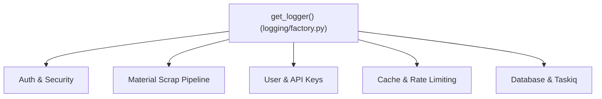
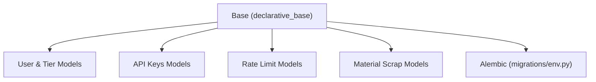

# 🏗️ Análise Arquitetural e Backlog de Refatorações (Graphify)

> **Data da Análise:** Agosto/2026  
> **Origem:** Extração e análise do grafo de conhecimento via Graphify (AST + Semântica)  
> **Status:** Backlog técnico para refatoração e otimização  

---

## 📌 Contexto da Análise

Durante a auditoria arquitetural realizada com o **Graphify**, foram mapeados mais de 2.800 nós e 9.200 conexões entre os módulos do sistema (**Backend FastAPI, Pipeline de Scraping, Banco de Dados, Autenticação e Automações**).

Esta análise investigou os principais **nós de ponte (*bridge nodes*)**, acoplamentos transversais e relações de domínio para identificar melhorias técnicas e mitigar riscos de manutenção a longo prazo.

---

## 🔍 Pontos Analisados e Diagnósticos

### 1. `get_logger()` e Acoplamento Transversal



* **Origem da Conexão:** A função `backend/src/infrastructure/logging/factory.py` implementa uma fábrica inteligente de logs com inspeção de pilha (`inspect.currentframe()`), contexto de correlação (`correlation_id`) e formatação estruturada (JSON/Detailed).
* **Diagnóstico:** Saudável. Logging é uma *Preocupação Transversal (Cross-Cutting Concern)* canônica. Não representa violação de arquitetura.
* **⚠️ O que refatorar / ajustar:**
  * **Custo de Reflexão:** Evitar invocar `get_logger()` dinamicamente dentro de métodos chamados repetidamente em loops ou *hot-paths* de processamento intensivo (devido ao overhead de `inspect.currentframe()`).
  * **Padrão Recomendado:** Instanciar `logger = get_logger(__name__)` estaticamente no topo de cada módulo.

---

### 2. `get_settings()` como Hub Central de Configuração

* **Origem da Conexão:** `backend/src/core/config/settings.py` provê uma instância singleton imutável via `@lru_cache` (Pydantic Settings). Módulos de banco de dados, Taskiq, Redis/Memcached e serviços de negócio importam e consultam flags globais diretamente.
* **Diagnóstico:** Funcional, mas aumenta o acoplamento do domínio com a infraestrutura global.
* **⚠️ O que refatorar / ajustar:**
  * **Inversão de Dependência (DIP):** Injetar configurações nas rotas via FastAPI `Depends(get_settings)`.
  * **Desacoplamento nos Serviços de Domínio:** Ao instanciar serviços de domínio, repassar apenas os valores primitivos necessários via construtor (ex: `MaterialScrapService(batch_size=settings.BATCH_SIZE)`), eliminando a dependência do singleton e facilitando testes unitários sem mock de variáveis de ambiente.

---

### 3. `Base` (SQLAlchemy Declarative Base) como Agregador do Modelo de Dados



* **Origem da Conexão:** `backend/src/infrastructure/database/session.py` provê o `MetaData` central do SQLAlchemy 2.0. Todos os modelos ORM herdam dessa classe base e de mixins compartilhados.
* **Diagnóstico:** Essencial e correto. Catálogo de metadados unificado é requisito do SQLAlchemy e do Alembic para constraints e migrações DDL.
* **⚠️ O que refatorar / ajustar:**
  * Não alterar a hierarquia da `Base`.
  * **Isolamento de Domínio:** Garantir que consultas entre módulos distintos (ex: `User` e `MaterialScrap`) passem por repositórios e serviços específicos, evitando queries cruzadas descontroladas via ORM em camadas de apresentação.

---

### 4. Relações Inferidas dos Enums de Material Scrap (`AutomationExecutionStatus`, etc.)

* **Origem da Conexão:** Em `backend/src/modules/material_scrap/enums.py`, enums baseados em `StrEnum` são utilizados em:
  1. Schemas de payload e filtros da API (`schemas.py`).
  2. Modelos de persistência e auditoria de execução (`models.py`).
  3. Agregações e projeções analíticas (`projection.py` e `dashboard_service.py`).
  4. Builder e automações do robô GERP (`builder.py`).
* **Diagnóstico:** As 97 relações inferidas estão 100% corretas. Representam a *Linguagem Ubíqua (Ubiquitous Language)* da máquina de estados do scraping e reconciliação.
* **⚠️ O que refatorar / ajustar:**
  * Manter `StrEnum` para serialização JSON nativa com Pydantic V2 sem conversores manuais.
  * Manter `enums.py` puramente declarativo (apenas tipos e contratos de estado, sem lógica operacional acoplada).

---

## 📋 Backlog de Tarefas Técnicas

| Prioridade | Tarefa | Módulo / Arquivo | Impacto |
|---|---|---|---|
| 🟡 **Média** | Padronizar instanciação de `logger = get_logger(__name__)` no topo dos arquivos e remover chamadas em loops | `backend/src/` | Redução de overhead de CPU e reflexão em *hot-paths* |
| 🟡 **Média** | Refatorar serviços de domínio para receber parâmetros primitivos no construtor em vez de importar `get_settings()` | `backend/src/modules/` | Facilidade de testes unitários e adesão ao princípio de Inversão de Dependência (DIP) |
| 🟢 **Baixa** | Auditar repositórios para garantir que não haja queries ORM cruzadas fora dos respectivos agregados de domínio | `backend/src/modules/*/repositories/` | Manutenção da coesão e isolamento de banco por módulo |
| 🟢 **Baixa** | Manter `enums.py` isolado e estritamente tipado com `StrEnum` | `backend/src/modules/material_scrap/enums.py` | Consistência na serialização e máquina de estados |

---

## 🔄 Como Atualizar este Relatório no Futuro

Sempre que novas refatorações forem concluídas no projeto, atualize o grafo executando:

```bash
# Atualização rápida da AST após mudanças de código
python -m graphify update .
```
