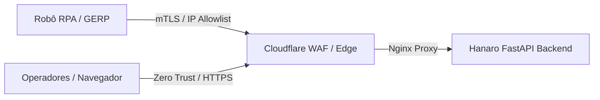

# Relatório de Auditoria de Segurança e Avaliação Cloudflare

**Escopo da Análise:** Backend de Monitoramento de Execuções GERP / Material Scrap (`feat(material-scrap): add GERP execution monitoring backend` - Commit `5712122`)  
**Data da Avaliação:** 30 de Agosto de 2026  
**Classificação Geral de Risco:** **BAIXO A MODERADO (Aprovado com Recomendações de Borda)**  
**Ambiente de Aplicação:** FastAPI + PostgreSQL + Taskiq + Redis + Nginx / Cloudflare Edge  

---

## 1. Sumário Executivo

O commit `5712122` introduziu o subsistema completo de rastreabilidade, ciclo de vida e monitoramento de execuções do robô RPA GERP para ingestão de Material Scrap. O subsistema abrange:
- Modelos relacionais no PostgreSQL (`ScrapAutomationExecution`, `ScrapExecutionStep`, `ScrapExecutionNotification`);
- Máquina de estados e operações de ciclo de vida em `execution_service.py`;
- Endpoints REST para ingestão, progresso de etapas, falhas e consulta de execuções em `routes.py`;
- Pipeline de alertas assíncronos e transactional outbox via Taskiq e SMTP em `tasks.py`.

A arquitetura apresenta **excelente maturidade de segurança em nível de código** (sanitização regex ativa de segredos, consultas 100% parametrizadas via SQLAlchemy 2.0, validação rigorosa via Pydantic V2 e isolamento transacional com lock pessimista). Este relatório estabelece as diretrizes de hardening para a camada de borda (**Cloudflare Edge / WAF / Zero Trust**) para mitigar riscos de exposição pública e abuso volumétrico.

---

## 2. Matriz de Avaliação OWASP API Security Top 10

| Código OWASP | Categoria de Risco | Status no Commit | Diagnóstico & Mitigações Existentes |
| :--- | :--- | :---: | :--- |
| **API1:2023** | Broken Object Level Authorization (BOLA) | **Mitigado** | Endpoints de consulta usam UUIDs aleatórios (`execution_id`) e dependência de autenticação `CurrentUserDep`. Modificações de ciclo de vida exigem chave de ingestão autenticada. |
| **API2:2023** | Broken Authentication | **Mitigado** | Separação estrita: endpoints do robô exigem API Key com permissão `material_scrap:write`; endpoints de consulta exigem sessão de usuário autenticada com cookies `HttpOnly` e `SameSite`. |
| **API3:2023** | Broken Object Property Level Authorization | **Mitigado** | Schemas dedicados de entrada (`AutomationExecutionStart`, `ExecutionStepUpdate`, `ExecutionFailure`) impedem atribuição em massa de campos protegidos (ex: `ingestion_run_id`, `created_at`). |
| **API4:2023** | Unrestricted Resource Consumption | **Atenção (Requer Borda)** | Paginação obrigatória com limites rígidos (`page_size` max 100). Requer regras de Rate Limiting adicionais no Cloudflare para chamadas sucessivas do robô. |
| **API5:2023** | Broken Function Level Authorization (BFLA) | **Mitigado** | Chave com escopo dedicado (`require_material_scrap_ingestion_key`) isolada dos privilégios de usuários comuns. |
| **API6:2023** | Unrestricted Access to Sensitive Business Flows | **Mitigado** | Prevenção de re-execuções inconsistentes com trava de estados terminais (`TERMINAL_EXECUTION_STATES`) e deduplicação canônica por hash SHA-256. |
| **API7:2023** | Server Side Request Forgery (SSRF) | **Mitigado** | Não há requisições dinâmicas a URLs fornecidas por clientes. O envio de e-mails usa apenas o servidor SMTP corporativo pré-configurado nas variáveis de ambiente. |
| **API8:2023** | Security Misconfiguration | **Mitigado** | Validador de segurança em produção (`production_validator.py`) impede inicialização com chaves padrão ou credenciais inseguras. |
| **API9:2023** | Improper Inventory Management | **Mitigado** | Todos os endpoints versionados sob `/api/v1/material-scrap/executions` com schemas OpenAPI gerados dinamicamente. |
| **API10:2023**| Unsafe Consumption of APIs | **Mitigado** | Respostas de serviços externos (GERP) passam por validação de tipagem, decodificação e normalização antes da gravação. |

---

## 3. Avaliação Técnica Detalhada

### 3.1. Controle de Acesso e Separação de Identidades

O design adota uma segregação de privilégios entre duas entidades distintas:
1. **Robô RPA (Machine-to-Machine):**
   * Autenticado exclusivamente via API Key no cabeçalho `X-API-Key` (ou `Authorization: Bearer`).
   * Validado pela dependência `require_material_scrap_ingestion_key`.
   * A chave deve possuir permissão explícita `material_scrap:write` e estar associada a uma conta ativa no banco de dados.
2. **Operadores e Dashboard (Human-to-Machine):**
   * Autenticados via sessão segura de cookies (`crudauth`).
   * Acesso somente leitura às listagens e detalhes de execuções via `CurrentUserDep`.
   * Proteção CSRF ativa (`X-CSRF-Token`) para todas as rotas mutantes acessadas pelo navegador.

### 3.2. Sanitização de Dados e Prevenção de Vazamento de Segredos

Um dos destaques do commit é a implementação do sanitizador de mensagens em `execution_service.py`:

```python
_SECRET_PATTERN = re.compile(r"(?i)(password|secret|token|cookie|authorization)\s*[:=]\s*\S+")

def sanitize_message(value: str) -> str:
    return _SECRET_PATTERN.sub(r"\1=[REDACTED]", value).strip()[:2000]
```

* **Benefício de Segurança:** Impede que logs de erro repassados pelo robô (como mensagens de falha de autenticação no GERP contendo senhas ou tokens de sessão) sejam persistidos em texto plano no banco de dados ou exibidos na interface do operador.
* **Truncamento de Payload:** Mensagens de erro são limitadas a 2.000 caracteres e metadados JSONB passam por deserialização tipada no Pydantic, mitigando estouro de memória e ataques de ampliação de payload.

### 3.3. Concorrência e Integridade de Transações

Para evitar condições de corrida (*Race Conditions*) quando múltiplos workers ou passos da automação tentam atualizar a mesma execução simultaneamente:
* As funções `update_step` e `mark_execution_failed` aplicam lock pessimista no PostgreSQL:
  ```python
  statement = select(ScrapAutomationExecution).where(...).with_for_update()
  ```
* Transições de estado terminal (`COMPLETED`, `FAILED`, `CANCELLED`) são imutáveis — qualquer tentativa subsequente de alteração gera `HTTP 409 Conflict`.

### 3.4. Resiliência do Transactional Outbox (Alertas por E-mail)

* Em caso de falha marcada via `/executions/{execution_id}/fail` com a flag `notify_developers=True`, o registro `ScrapExecutionNotification` é inserido na mesma transação atômica.
* O disparo real do e-mail é delegado ao worker Taskiq via `enqueue_execution_notification`.
* **Proteção contra Falhas em Cascata:** Se o broker Taskiq ou o servidor SMTP estiverem temporariamente indisponíveis, a falha da automação permanece registrada e o outbox pode ser reprocessado sem comprometer a integridade da API.
* **Prevenção de Email Header Injection:** O método `_send_failure_email` utiliza `email.message.EmailMessage` da biblioteca padrão, o qual valida e rejeita quebras de linha (`\r\n`) injetadas nos cabeçalhos `Subject` e `To`.

---

## 4. Recomendações de Configuração no Cloudflare

Para garantir a proteção em profundidade (*Defense in Depth*) na borda da infraestrutura, recomenda-se a aplicação das seguintes regras no painel do Cloudflare:



### 4.1. Regras de Acesso e Restrição de IP (WAF Custom Rules)
Os endpoints de mutação da automação devem ser restritos aos IPs dos servidores onde o RPA executa:

* **Regra de Borda para Ingestão e Ciclo de Vida:**
  * **URI Path:** `starts_with "/api/v1/material-scrap/executions"` ou `equals "/api/v1/material-scrap/ingest"`
  * **Methods:** `POST`, `PUT`, `PATCH`, `DELETE`
  * **Condição:** `not ip.src in { $RPA_RUNNER_IPS $INTRANET_GATEWAY_IPS }`
  * **Ação:** `Block` (ou `Managed Challenge`)

### 4.2. Rate Limiting no Cloudflare
Configurar regras de limitação de taxa para impedir ataques de negação de serviço e força bruta em API Keys:

1. **Mutação de Etapas (`/executions/*/steps/*` e `/executions/*/fail`):**
   * Limite: **120 requisições por minuto** por IP de origem.
   * Ação: `Block` por 5 minutos após exceder o limite.
2. **Ingestão de Lote Completo (`/ingest` e `/ingest-sync`):**
   * Limite: **10 requisições por minuto** por IP de origem (cada lote representa um ciclo completo de scrap).
   * Ação: `Block` por 15 minutos.

### 4.3. Regras de Cache (Cache Rules / Page Rules)
Garantir que respostas dinâmicas da API nunca sejam retidas nos PoPs do Cloudflare:

* **Regra:**
  * **URI Path:** `starts_with "/api/"`
  * **Cache Eligibility:** `Bypass Cache`
  * **Header Preservation:** Preservar cabeçalhos `Set-Cookie`, `Authorization` e `X-API-Key`.

### 4.4. Limite de Tamanho de Corpo de Requisição (Request Body Limit)
* Para a rota `/api/v1/material-scrap/ingest`, definir o tamanho máximo do corpo no Cloudflare em **25 MB** (suficiente para payloads com milhares de registros de material scrap em JSON).

---

## 5. Plano de Ação e Recomendações de Melhoria Contínua

1. **mTLS (Mutual TLS) no Cloudflare API Shield (Opcional / Alta Segurança):**
   * Configurar certificado de cliente para a comunicação entre o script do robô GERP e a API Hanaro, garantindo autenticação em nível de transporte criptográfico além da API Key.
2. **Rotação Automática de Chaves de API:**
   * Utilizar a funcionalidade de data de expiração (`expires_at`) do módulo `api_keys` para rotacionar as credenciais do robô semestralmente.
3. **Monitoramento de Notificações com Status `FAILED`:**
   * Criar uma rotina agendada (cron via Taskiq) para reprocessar notificações de falha que permaneceram no outbox com status `FAILED` após instabilidades transitórias de SMTP.

---

## 6. Conclusão

A implementação introduzida no commit `5712122` é **robusta, resiliente e segura**, adotando práticas recomendadas de isolamento transacional, validação tipada e prevenção de vazamento de credenciais. A adição das políticas de borda do Cloudflare recomendadas neste relatório assegura a proteção ideal contra ameaças externas e abuso de recursos.
