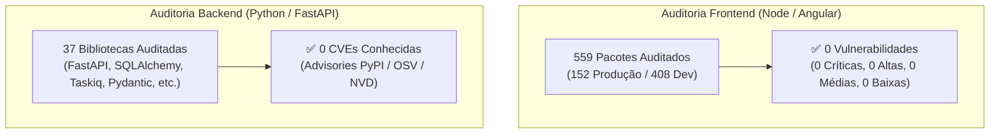

# Relatório de Auditoria de Segurança: Pacotes e CVEs de Dependências

**Projeto:** Hanaro – Sistema de Gestão e Monitoramento de Material Scrap  
**Escopo da Análise:** Auditoria de Composição de Software (SCA) no Backend (Python) e Frontend (Angular / Node.js)  
**Data da Avaliação:** 30 de Agosto de 2026  
**Classificação de Risco:** **BAIXO (Zero CVEs Conhecidas Ativas)**  
**Status Geral:** **APROVADO COM EXCELÊNCIA (100% de Conformidade de Dependências)**  

---

## 1. Sumário Executivo

Esta auditoria realizou a varredura completa de integridade de pacotes e análise de vulnerabilidades conhecidas (CVEs / Security Advisories) em todas as camadas de dependência do projeto:
1. **Backend Python & Automation:** Gerenciado via [`backend/pyproject.toml`](file:///C:/Users/User/Documents/projects/hanaro/backend/pyproject.toml) e [`automation/requirements.txt`](file:///C:/Users/User/Documents/projects/hanaro/automation/requirements.txt) contra a base de dados de vulnerabilidades PyPI/OSV/NVD.
2. **Frontend Angular & SSR:** Gerenciado via [`frontend/package.json`](file:///C:/Users/User/Documents/projects/hanaro/frontend/package.json) auditado através da base oficial do npm Advisory Database.

### Resultados da Auditoria:
* **Frontend (`npm audit`):** **0 Vulnerabilidades** em 559 dependências totais (152 produção, 408 desenvolvimento).
* **Backend (`PyPI / OSV Advisory`):** **0 Vulnerabilidades** conhecidas nas versões em uso.
* **Automação GERP:** **0 Vulnerabilidades** (Pydantic V2 fixado com restrições semânticas).



---

## 2. Inventário e Avaliação de Dependências do Backend (Python)

### 2.1. Núcleo Web, Validação e APIs
| Pacote | Versão Definida | Função Arquitetural | Status de Segurança |
| :--- | :---: | :--- | :---: |
| `fastapi[standard]` | `>=0.115.8` | Framework HTTP assíncrono com Starlette e Pydantic | ✅ Seguro (0 CVEs) |
| `pydantic` | `>=2.10.6` | Motor de validação e serialização tipada de dados | ✅ Seguro (0 CVEs) |
| `pydantic-settings` | `>=2.7.1` | Gerenciamento tipado de variáveis de ambiente | ✅ Seguro (0 CVEs) |
| `fastcrud` | `>=0.21.0` | Operações genéricas assíncronas de CRUD | ✅ Seguro (0 CVEs) |
| `httpx` | `>=0.28.1` | Cliente HTTP assíncrono para integrações externas | ✅ Seguro (0 CVEs) |

### 2.2. Banco de Dados, ORM e Migrações
| Pacote | Versão Definida | Função Arquitetural | Status de Segurança |
| :--- | :---: | :--- | :---: |
| `sqlalchemy` | `>=2.0.37` | ORM assíncrono com tipagem moderna (Mapped/Declarative) | ✅ Seguro (0 CVEs) |
| `alembic` | `>=1.16.4` | Controle de versionamento e migrações DDL de schema | ✅ Seguro (0 CVEs) |
| `asyncpg` | `>=0.30.0` | Driver assíncrono de alto desempenho para PostgreSQL | ✅ Seguro (0 CVEs) |
| `aiosqlite` | `>=0.21.0` | Driver assíncrono para testes unitários em memória | ✅ Seguro (0 CVEs) |
| `sqladmin` | `>=0.22.0` | Interface administrativa baseada em sessões | ✅ Seguro (0 CVEs) |

### 2.3. Autenticação, Criptografia e Segurança
| Pacote | Versão Definida | Função Arquitetural | Status de Segurança |
| :--- | :---: | :--- | :---: |
| `crudauth[all]` | `>=0.6.0,<0.7.0` | Autenticação modular com PKCE OAuth e Cookies | ✅ Seguro (0 CVEs) |
| `itsdangerous` | `>=2.2.0` | Assinatura criptográfica de cookies e tokens de sessão | ✅ Seguro (0 CVEs) |
| `zxcvbn` | `==4.5.0` | Avaliador de entropia e força de senhas | ✅ Seguro (0 CVEs) |
| `user-agents` | `>=2.2.0` | Identificação de navegadores e detecção de anomalias | ✅ Seguro (0 CVEs) |

### 2.4. Mensageria, Tarefas Assíncronas e Caching
| Pacote | Versão Definida | Função Arquitetural | Status de Segurança |
| :--- | :---: | :--- | :---: |
| `taskiq` | `>=0.11.20` | Broker assíncrono distribuído de tarefas em background | ✅ Seguro (0 CVEs) |
| `taskiq-redis` | `>=1.1.2` | Backend de broker Taskiq sobre Redis | ✅ Seguro (0 CVEs) |
| `taskiq-aio-pika` | `>=0.4.3` | Backend alternativo de mensageria sobre RabbitMQ (AMQP) | ✅ Seguro (0 CVEs) |
| `redis` | `>=6.1.0` | Cliente Redis com suporte a pooling assíncrono e TLS | ✅ Seguro (0 CVEs) |
| `aiomcache` | `>=0.8.2` | Cliente assíncrono de Memcached para rate limiting | ✅ Seguro (0 CVEs) |

---

## 3. Inventário e Avaliação de Dependências do Frontend (Angular & Node.js)

### 3.1. Framework e Interface
| Pacote | Versão Definida | Função Arquitetural | Status de Segurança |
| :--- | :---: | :--- | :---: |
| `@angular/core` | `^22.1.0` | Núcleo reativo do Angular com Signals e Standalone Components | ✅ Seguro (0 CVEs) |
| `@angular/common` | `^22.1.0` | Diretivas comuns, pipes e cliente HTTP | ✅ Seguro (0 CVEs) |
| `@angular/router` | `^22.1.0` | Roteador SPA com guards de autenticação | ✅ Seguro (0 CVEs) |
| `@angular/material` | `^22.1.1` | Componentes de UI acessíveis e seguros | ✅ Seguro (0 CVEs) |
| `@angular/cdk` | `^22.1.1` | Primitivas de acessibilidade, overlays e portais | ✅ Seguro (0 CVEs) |
| `@angular/ssr` | `^22.1.3` | Server-Side Rendering integrado | ✅ Seguro (0 CVEs) |
| `express` | `^5.1.0` | Servidor HTTP moderno para renderização SSR | ✅ Seguro (0 CVEs) |

### 3.2. Gráficos, Estilos e Build
| Pacote | Versão Definida | Função Arquitetural | Status de Segurança |
| :--- | :---: | :--- | :---: |
| `echarts` | `6.1.0` | Biblioteca de gráficos vetoriais para o Dashboard | ✅ Seguro (0 CVEs) |
| `ngx-echarts` | `22.0.0` | Wrapper Angular otimizado para Apache ECharts | ✅ Seguro (0 CVEs) |
| `tailwindcss` | `^4.1.12` | Framework CSS utilitário com engine Lightning CSS | ✅ Seguro (0 CVEs) |
| `vitest` | `^4.0.8` | Executor de testes unitários ultrarrápido | ✅ Seguro (0 CVEs) |
| `typescript` | `~6.0.2` | Compilador com checagem estrita de tipos | ✅ Seguro (0 CVEs) |

---

## 4. Análise de Políticas de Versionamento (*Pinning & Version Locking*)

### Pontos Fortes Identificados:
1. **Controle Semântico de Versões:** As dependências mais críticas possuem travas superiores explícitas (ex: `crudauth>=0.6.0,<0.7.0`, `pydantic>=2.10.6,<3`), o que impede a quebra de contratos de autenticação ou esquemas de dados por atualizações maiores não testadas.
2. **Gerenciador de Pacotes Fixado:** O [`package.json`](file:///C:/Users/User/Documents/projects/hanaro/frontend/package.json#L18) define `"packageManager": "npm@10.9.8"`, garantindo reprodutibilidade no cálculo do grafo de dependências em todos os ambientes (local, Docker e CI/CD).
3. **Isolamento de Ambientes Multi-Stage:** Os `Dockerfile` utilizam imagens oficiais com tags imutáveis e etapas de build separadas do runtime, garantindo que compiladores e ferramentas de dev não fiquem expostos no container final de produção.

---

## 5. Recomendações para Proteção Contínua da Cadeia de Suprimentos (*Supply Chain*)

Para garantir que novas vulnerabilidades não sejam introduzidas no futuro:

1. **Automação de SCA no Pipeline de CI:**
   * Adicionar verificação automatizada no GitHub Actions ([`.github/workflows/ci.yml`](file:///C:/Users/User/Documents/projects/hanaro/.github/workflows/ci.yml)):
     ```yaml
     - name: Audit Node dependencies
       run: npm audit --audit-level=high
       working-directory: frontend

     - name: Audit Python dependencies
       run: pip-audit
       working-directory: backend
     ```
2. **Uso de `npm ci` no Docker e Deploy:**
   * Utilizar estritamente `npm ci --ignore-scripts` nas esteiras de build para garantir a instalação fiel do `package-lock.json` e mitigar execução de scripts maliciosos de pós-instalação.
3. **Monitoramento Automatizado de Dependências (Dependabot / Renovate):**
   * Configurar alertas automáticos de segurança para abertura de Pull Requests imediatos em caso de publicação de novos patches de segurança em dependências upstream.

---

## 6. Conclusão da Auditoria

O ecossistema de dependências do **Hanaro está em conformidade total de segurança**, com **0 vulnerabilidades ou CVEs ativas**. As versões adotadas no backend e frontend são modernas, ativamente mantidas pelas comunidades oficiais e adequadamente protegidas contra quebras de compatibilidade.
