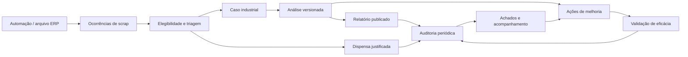

# 02 — Domínio, responsabilidades e fluxos de trabalho

[Índice](README.md) · [Modelo de dados](03-modelo-de-dados.md)

Este documento define comportamento proposto. Limites numéricos dos exemplos são ilustrativos e precisam ser calibrados pela Qualidade.

## 1. Separar os objetos antes de desenhar novas telas

Uma ocorrência corresponde à identidade de um lançamento da base; o caso corresponde ao problema investigado. “Prego na esteira danificou monitores” pode ser um caso com diversos componentes e lançamentos, não vinte investigações independentes. Já dois danos iguais em datas próximas podem ter causas diferentes: o sistema sugere agrupamento, o analista decide.

A análise descreve problema, evidências, causa e decisão. O relatório é uma edição desse conteúdo emitida para consulta, reunião ou auditoria. A ação materializa uma decisão operacional. Concluir o relatório não encerra automaticamente a ação, e encerrar um caso não elimina ocorrências ou perdas contabilizadas.

## 2. Papéis e autoridade proposta

Permissões são capacidades com escopo de fábrica/linha, não apenas nomes de cargo. Inicialmente aproveitar usuários existentes e acrescentar atribuições. Não reaproveitar `tier` comercial como papel de Qualidade.

| Papel | Responsabilidades | Restrições relevantes |
| --- | --- | --- |
| Integração/RPA | Entregar lotes e atualizar execução | Não aprova análises, ações ou dados de produção |
| Apontador de produção | Lançar/corrigir produção autorizada | Não alterar produção aprovada silenciosamente |
| Analista de Qualidade | Triar, investigar, propor dispensa, analisar e emitir conforme alçada | Não alterar origem ERP; não validar a própria ação quando exigida independência |
| Responsável da ação | Aceitar tarefa, executar, anexar evidências e declarar conclusão | Não transforma conclusão em eficácia por conta própria |
| Coordenador | Distribuir casos, aprovar exceções/publicações, validar eficácia | Decisões ficam registradas; administração técnica não confere aprovação automática |
| Auditor | Planejar ciclo, definir amostra, registrar achados, concluir auditoria | Não editar o documento examinado; conflitos de interesse precisam de substituto |
| Gestor | Consultar consolidados e deliberar prioridades | Edição apenas nas capacidades explicitamente atribuídas |
| Administrador | Manter catálogos, usuários, integrações e regras | Alterações de regra exigem versão e vigência |
| Tela TV | Consumir contrato agregado permitido | Sem sessão pessoal, comentários de casos ou anexos privados |

Equipes pequenas podem acumular funções. A política deve exigir outro aprovador para itens críticos e registrar exceções de segregação quando a estrutura não permitir; não fingir independência inexistente.

## 3. Elegibilidade: quem precisa ser revisado

Manter três eixos independentes:

| Eixo | Valores propostos | Exemplo |
| --- | --- | --- |
| Presença na origem | `ACTIVE`, `NOT_PRESENT`, `SUPERSEDED` | Registro desapareceu de um snapshot completo |
| Inclusão na métrica | `INCLUDED`, `EXCLUDED`, `UNMAPPED` | Conta fora do IF Cost executivo, mas ainda relevante para Qualidade |
| Obrigatoriedade de análise | `REQUIRED`, `OPTIONAL`, `EXEMPT`, `UNDETERMINED` | Alto custo obrigatório; baixo risco elegível à dispensa |

Resultado de política tem versão, condições correspondentes, explicação, responsável pelo override e data. `UNDETERMINED` vai para fila de classificação; não vira `EXEMPT`. Uma ocorrência dispensada continua na métrica se a política da métrica a inclui.

Proposta de precedência: gatilho crítico de risco → recorrência ou custo/quantidade acima do limite → regra específica de processo/conta → política padrão. A regra mais específica não pode anular silenciosamente um gatilho crítico. Empate usa prioridade explícita; conflito de regras gera diagnóstico antes de publicar a política.

| Condição ilustrativa | Resultado | Tratamento |
| --- | --- | --- |
| Risco alto explicitamente informado, ou gatilho crítico definido | `REQUIRED` | Distribuição imediata e prazo específico |
| Custo elegível >= R$ 5.000 no recorte definido | `REQUIRED` | Revisão do caso e possível aprovação da coordenação |
| Três eventos semelhantes na mesma linha em sete dias | `REQUIRED` | Sugerir investigação de recorrência, sem fundir casos automaticamente |
| Baixo impacto, causa conhecida e procedimento vigente | `OPTIONAL` ou `EXEMPT` conforme regra | Registrar motivo, versão do procedimento e prazo da dispensa |
| Linha/conta sem mapeamento | `UNDETERMINED` | Corrigir catálogo ou decidir manualmente |

Separar **dispensa automática por política** de **exceção manual a uma obrigação**. A segunda exige motivo e aprovador segundo alçada. Revisão voluntária de um item opcional não muda o denominador de obrigações do mês.

Toda mudança de política começa com simulação: quantos itens se tornariam obrigatórios, dispensados ou indeterminados; impacto por linha; estimativa de carga por analista. Mudança retroativa exige operação expressa com período e justificativa. Reavaliação não apaga decisões históricas.

## 4. Estados e transições

### 4.1 Caso e análise

| Transição | Precondições | Resultado |
| --- | --- | --- |
| `NEW → TRIAGED` | Elegibilidade avaliada, escopo identificado | Prioridade e responsável definidos |
| `TRIAGED → INVESTIGATING` | Analista aceita ou coordenação atribui | Início do prazo de investigação registrado |
| `INVESTIGATING → AWAITING_APPROVAL` | Problema, evidências, causa ou hipótese, decisão preenchidos | Versão de análise submetida |
| `AWAITING_APPROVAL → ANALYZED` | Aprovação exigida concluída; ou alçada autoriza autoemissão | Análise publicada internamente, pronta para relatório |
| `AWAITING_APPROVAL → INVESTIGATING` | Devolução motivada | Nova edição, sem sobrescrever a submetida |
| `ANALYZED → CLOSED` | Ações obrigatórias eficazes, ou decisão válida sem ação | Encerramento do caso |
| `CLOSED → INVESTIGATING` | Recorrência/correção motivada | Reabertura preserva encerramento anterior |

No MVP, casos de baixo risco podem passar de investigação para análise mediante autoaprovação autorizada e registrada. Não exigir um ritual de aprovação manual para todo registro.

A análise deve separar: condição observada, contenção imediata, causa suspeita, causa confirmada, método de análise, 4M, decisão e evidências. 4M é classificação, não prova de causa. Permitir “causa não confirmada” durante investigação; para concluir, a política pode exigir investigação adicional ou aceitar limitação documentada.

Decisões possíveis: `ACTION_REQUIRED`, `MONITOR_ONLY`, `NO_ACTION_REQUIRED`. Monitoramento exige responsável, período e gatilho de reabertura. Sem ação exige razão e, quando aplicável, procedimento existente e aprovador. Não criar cartões fictícios para justificar ausência de ação.

### 4.2 Relatório

`DRAFT → IN_REVIEW → PUBLISHED`. Devolução retorna a rascunho criando outra versão de trabalho. Uma edição publicada é somente leitura. Retificação cria outra edição com `supersedes_version_id`; retirada registra motivo, ator e data, sem apagar o artefato antigo.

A aprovação do conteúdo e a geração do arquivo têm estados diferentes. É possível ter conteúdo publicado e exportação em processamento/falha. Nunca mostrar “PDF pronto” porque apenas a análise foi aprovada.

### 4.3 Ações e Kanban

Estados canônicos: `PLANNED → IN_PROGRESS → IMPLEMENTED → UNDER_VERIFICATION → EFFECTIVE`. Adicionar `CANCELLED` com motivo. Falha de eficácia retorna a `IN_PROGRESS` ou cria ação sucessora, preservando a verificação negativa.

“Bloqueada” é condição paralela (`blocked_at`, motivo, responsável pela remoção), pois uma ação pode ser bloqueada durante execução ou verificação. Na interface pode existir uma raia/filtro de bloqueadas; não perder a fase original ao mover o cartão.

| Transição | Dados obrigatórios |
| --- | --- |
| Criar planejada | Título, problema, origem/manual, escopo, dono, prazo, risco |
| Iniciar | Aceite do responsável e data de início |
| Declarar implementada | Evidência de execução, data, resultado observado |
| Iniciar verificação | Métrica, baseline, janela posterior, volume mínimo e avaliador |
| Validar eficaz | Resultado calculado, interpretação, critério atendido, avaliador autorizado |
| Cancelar | Justificativa, alçada e tratamento dos casos vinculados |

Progresso percentual deve ser opcional e derivado de checklist verificável. Não usar percentuais fixos por coluna, como “90% aguardando eficácia”, para aparentar precisão.

### 4.4 Auditoria periódica

`PLANNED → OPEN → FIELDWORK → IN_REVIEW → CLOSED`, com cancelamento motivado. Achados têm ciclo próprio: `OPEN → RESPONSE_REQUESTED → ACTION_IN_PROGRESS → AWAITING_VALIDATION → CLOSED`.

Encerrar uma auditoria publica sua conclusão. Ela pode ficar “encerrada com ações em acompanhamento”; não manter todo o ciclo artificialmente aberto por meses. Achados críticos sem tratamento aceito bloqueiam encerramento conforme política.

## 5. Fluxos completos de exemplo

### A. Prego na esteira danifica monitores

1. A automação publica três lançamentos relacionados: painéis, carcaças e mão de obra/conta elegível, conforme o que a fonte efetivamente fornece. Valores ilustrativos: R$ 4.800, R$ 900 e R$ 300; total de R$ 6.000.
2. Triagem identifica linha A02, janela temporal e referência de produção. A regra de custo torna análise obrigatória. Não presumir que os três lançamentos representam três monitores.
3. Analista cria `CAS-2026-0042` e liga as três ocorrências. Informa separadamente 12 monitores afetados, com evidência dessa contagem; quantidade de componentes do ERP não vira automaticamente quantidade de produtos defeituosos.
4. Registra contenção, fotos, hipótese de objeto estranho, investigação e confirmação de causa. A decisão pede proteção física e inspeção de início de turno.
5. Publica análise v1 e relatório `REL-2026-0042`, edição 1, fixando transações, fotos e custo de R$ 6.000.
6. Cria duas ações: instalar proteção e revisar checklist. O valor exposto é do caso, não R$ 6.000 de economia realizada em cada cartão.
7. Responsáveis implementam; Qualidade verifica recorrência em quatro semanas e volume mínimo acordado. Se a linha não produzir, o resultado é inconclusivo, não sucesso.
8. Auditoria mensal examina relatório e evidências das ações. A conclusão registra eficácia ou abre achado.
9. Se ERP corrigir o total para R$ 5.700, o dashboard corrente pode refletir o valor corrigido. Edição 1 continua R$ 6.000, marcada com atualização de origem disponível; uma retificação emite edição 2 quando cabível.

### B. Perda de baixo risco que dispensa revisão

Uma ocorrência de consumo previsto em ajuste de processo atende a uma regra de dispensa vigente. Registrar `EXEMPT`, regra, motivo e valor. Ela continua no IF Cost se incluída na métrica. Auditoria seleciona parte dessas dispensas para verificar uso correto. Se surgir recorrência ou a dispensa estiver sendo abusada, abrir achado e reavaliar a política.

### C. Relatório conclui que não cabe nova ação

Analista confirma que o evento está coberto por medida já implementada e não requer outra intervenção. Vincula a ação existente, registra evidência e decisão `NO_ACTION_REQUIRED`. Coordenador aprova quando a alçada exige. O relatório pode ser publicado sem criar nova ação; não duplicar economia ou trabalho.

### D. Produção manual hoje, integração depois

Apontador abre Configurações → Produção realizada, escolhe fábrica, linha e dia, informa quantidade e evidência. Validador aprova. Uma correção posterior gera revisão com justificativa. Quando a integração chegar, um valor conflitante entra em reconciliação; a automação não sobrepõe o manual aprovado silenciosamente. O ranking mostra de qual origem/revisão recebeu o denominador.

### E. Auditoria mensal de governança

Coordenador abre ciclo de setembro: fábrica selecionada, população congelada de ocorrências, decisões e relatórios. Inclui todas as situações críticas e amostra estratificada de dispensas/baixo risco. Auditor examina documentos, atrasos, reincidência e consistência de produção. Publica resultado, achados e responsáveis. Na reunião seguinte, verifica o tratamento dos achados ainda abertos.

### F. Ação preventiva sem scrap de origem

Um líder identifica risco antes de acontecer perda. Cria ação manual com linha, problema, responsável e risco. O sistema não inventa ocorrência nem custo evitado. A ação pode depois ser ligada a um caso ou achado, mantendo a origem manual e o histórico da vinculação.

## 6. SLAs e calendário

Separar prazo de triagem, prazo da análise, prazo de implementação e prazo de eficácia. Guardar política e calendário usados no cálculo: fuso da fábrica, dias úteis, turnos, feriados e pausas autorizadas. Para o MVP, dias corridos com fuso explícito são aceitáveis se comunicados; não chamar isso de dias úteis.

Prazos vencidos são derivados do instante atual e do estado, não uma coluna booleana permanente. Prorrogação exige motivo e guarda prazo anterior. Bloqueio não suspende SLA automaticamente: depende de regra e aprovação.

## 7. Alertas de negócio

Separar estado do evento (`OPEN`, `ACKNOWLEDGED`, `RESOLVED`) da leitura por usuário e da entrega por canal. E-mail enviado não significa incidente resolvido. Arquivamento é apresentação/retensão, não correção operacional.

Chave de deduplicação proposta: regra + versão + escopo + janela + identidade do evento. Reavaliar uma janela atualiza o alerta existente; repetição relevante pode reabrir ou criar episódio relacionado. Configurar período de silêncio, agrupamento e escalonamento para evitar tempestade de mensagens.

Alertas só devem usar dados com cobertura suficiente; “sem dados” é alerta de qualidade operacional separado de “zero scrap”. Alerta pode sugerir caso ou ação, mas não atribuir causa automaticamente.
