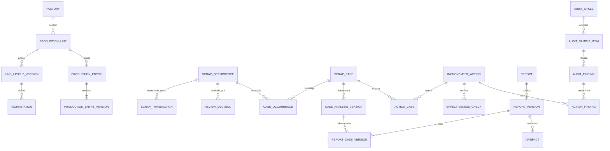

# 03 — Modelo de dados e evolução do schema

[Índice](README.md) · [APIs](04-apis-e-processamento.md)

Modelo lógico proposto. Os nomes indicam fronteiras de domínio, não uma exigência de implementar todas as tabelas no primeiro incremento. PKs novas usam UUID; referências ao usuário existente continuam com o tipo da tabela `user`. Valores monetários usam `NUMERIC`, nunca float.

## 1. Regras de modelagem

Separar quatro tempos: data do fato industrial, momento da extração, momento da ingestão e momento da decisão/publicação. Guardar timestamps com fuso; usar `date` para dia produtivo, associado ao calendário da fábrica.

Fonte, interpretação e documento são camadas diferentes. Dados de origem retidos não são alterados por classificação; novas classificações geram novas versões. Campos JSONB comportam evidência/estrutura versionada, mas relações fundamentais, estado, proprietário e período têm colunas tipadas e constraints.

IDs de fábrica/linha não são nomes editáveis. Código externo é um alias com escopo e vigência. `receipt_department` precisa de mapeamento validado; não assumir que representa sempre linha física. `organization_code` não é automaticamente fábrica.

## 2. Visão relacional principal



O diagrama omite tabelas de suporte e FKs secundárias por legibilidade. O dicionário abaixo determina a granularidade de cada uma.

## 3. Catálogos e produção

| Tabela | Grão e campos principais | Integridade |
| --- | --- | --- |
| `factories` | Uma fábrica: `id`, `code`, `name`, `timezone`, `active` | `UNIQUE(code)`; não excluir se referenciada |
| `production_lines` | Uma identidade de linha: `factory_id`, `code`, `name`, `active_from/to` | Código único na fábrica; renomear não muda ID |
| `line_layout_versions` | Uma configuração com vigência: `line_id`, `version`, `valid_from/to`, `layout_json` | Versões únicas; sem intervalos de vigência sobrepostos |
| `workstations` | Um posto no layout: `layout_version_id`, `code`, `name`, `sequence` | `UNIQUE(layout_version_id, code)`; preservar referência histórica |
| `source_dimension_mappings` | Alias ERP → fábrica/linha/produto/posto, com contexto e vigência | Uma resolução inequívoca por chave/contexto/data; ambiguidades vão para pendência |
| `production_entries` | Uma célula fábrica/linha/dia no MVP: `line_id`, `production_date`, `current_approved_version_id` | `UNIQUE(line_id, production_date)`; ponteiro apenas para versão da própria célula |
| `production_entry_versions` | Uma declaração de quantidade: `entry_id`, `version`, `produced_quantity`, `unit`, `source`, `status`, autor/aprovador, motivo, evidência | Quantidade >=0; unidade explícita; `UNIQUE(entry_id,version)`; aprovado imutável |
| `production_import_batches` | Futuro arquivo/coleta: hash, origem, escopo, estado e conflitos | Idempotência por origem/chave externa; não sobrescrever aprovado |
| `comparison_groups` / `comparison_group_memberships` | Grupo de linhas comparáveis por produto/processo, com vigência | Uma linha não duplica no mesmo grupo/período |
| `metric_target_versions` | Meta por métrica, período e escopo; versão, vigência e aprovação | Mesmo escopo não possui duas versões efetivas conflitantes |

MVP usa **produção por linha/dia**, não por turno/modelo sem fonte correspondente. Se o usuário filtrar por um modelo cujo denominador não existe, a taxa fica indisponível. Expansão por turno/modelo deve adicionar granularidade explicitamente, sem somar total diário e detalhamento no mesmo fato. Uma revisão deve escolher total autoritativo ou composição dos detalhes, nunca ambos.

Zero aprovado significa linha sem produção. Célula ausente significa produção não informada. Acrescentar calendário de operação (`line_operating_days`: linha/dia, esperado operar, motivo) para distinguir férias/parada de falha de preenchimento.

## 4. Ingestão, identidade e classificação

| Entidade atual | Evolução proposta |
| --- | --- |
| `scrap_ingestion_runs` / arquivos | Guardar referência ao objeto bruto privado, hash e manifesto de cobertura |
| `scrap_reconciliation_partitions` | Adicionar fonte autoritativa, `last_source_sequence`, última extração aceita e revisão publicada |
| `scrap_occurrences` | Manter IDs existentes; acrescentar ID estável de origem quando disponível e relação de substituição |
| `scrap_transactions` | Preservar observações existentes; novas versões de fonte não recebem atualização in-place por reclassificação |
| `scrap_occurrence_observations` | Continuar ligando lote, ocorrência e transação observada |
| `scrap_classification_rules` | Migrar para cabeçalho estável + versões de regras com vigência e prioridade |
| `scrap_dashboard_aggregates` | Tratar como projeção corrente por ocorrência; evolução para gerações e rollups separados |

Novas tabelas sugeridas:

| Tabela | Campos essenciais | Regra |
| --- | --- | --- |
| `ingestion_partition_manifest` | `run_id`, fábrica/organização, dia, modo completo/parcial, `expected_rows`, checksum, sequência da origem | Única por lote/partição; zero explícito só tem autoridade se completo |
| `occurrence_identity_aliases` | `occurrence_id`, sistema, versão da chave, chave externa | Unique por sistema/versão/chave; dados ambíguos exigem resolução |
| `occurrence_supersessions` | anterior, sucessora, motivo, ator, confiança, data | Sem auto-referência/ciclos; nunca apaga revisão da anterior |
| `classification_rule_versions` | regra, versão, configuração, vigência, aprovador | Imutável após ativação |
| `occurrence_classification_versions` | ocorrência, transação fonte, versão, linha/produto/posto, inclusões de métricas, proveniência | Uma versão corrente por ocorrência; histórico preservado |
| `review_policy_versions` | política, versão, regras, vigência, autor/aprovador | Simulação antes da ativação |
| `review_decisions` | ocorrência, versão de fonte, política, resultado, reason codes, explicação, override, responsável, prazo | Append-only; ponteiro corrente separado; uma decisão não redefine custo |

Não calcular a nova identidade removendo quantidade/valor de todas as chaves antigas sem análise: lançamentos legítimos iguais podem colidir. Preferir ID ERP e migrar com tabela de correspondência; candidatos ambíguos permanecem separados até decisão registrada.

## 5. Casos e análises

| Tabela | Campos essenciais | Regra |
| --- | --- | --- |
| `scrap_cases` | fábrica, código legível, título, status, risco, dono, prazos, `version` | Código único por fábrica; dono ativo ou pendência de redistribuição |
| `case_occurrences` | caso, ocorrência, tipo de vínculo, `linked_at`, `unlinked_at`, ator/motivo | Um vínculo ativo por par; vínculo histórico preservado |
| `case_analysis_versions` | caso, revisão, problema, contenção, causa suspeita/confirmada, 4M, método, decisão, justificativa, autor, status | Submissão/publicação congela versão; `UNIQUE(case_id,version)` |
| `analysis_occurrence_versions` | análise, ocorrência, transação e classificação selecionadas | Congela o conjunto investigado; unique por análise/ocorrência |
| `evidence_objects` | chave privada, sha256, MIME, tamanho, original, autor, estado de validação | Conteúdo identificado por hash; acesso via autorização da entidade |
| `analysis_evidence` | análise, evidência, papel, legenda e ordem | FK real; não copiar binário desnecessariamente |
| `case_assignment_events` | caso, de/para, motivo, autor, data | Histórico de responsabilidade |

MVP: uma ocorrência possui no máximo **um caso principal ativo**, para evitar analistas paralelos contraditórios. Índice parcial pode impor isso no vínculo `PRIMARY`. Vínculos adicionais `RELATED` dão contexto, sem duplicar perdas. Futuras análises sobrepostas não devem remover essa regra sem estratégia financeira explícita.

O mesmo relatório pode consolidar vários casos; a soma usa o conjunto distinto de ocorrências da edição, não a soma ingênua dos totais de casos sobrepostos.

## 6. Ações de melhoria

| Tabela | Campos essenciais | Integridade |
| --- | --- | --- |
| `improvement_actions` | título, descrição, estado, risco, dono, área, início, prazo, implementação, bloqueio, versão, origem manual | Alçadas e transições no serviço; `version >=1` |
| `action_cases` | ação, caso, papel do vínculo | Unique por par; N:N sem duplicação de custo |
| `action_findings` | ação, achado | Uma ação pode tratar vários achados |
| `action_steps` | ação, descrição, ordem, responsável, conclusão | Checklist auditável; percentual deriva dos passos quando utilizado |
| `action_evidence` | ação, evidência, etapa/legenda | Reutiliza armazenamento, preserva contexto |
| `action_state_events` | ação, origem/destino, motivo, autor, instante, versão | Histórico completo inclusive retorno |
| `effectiveness_checks` | ação, plano de medição, baseline, janela posterior, resultado, avaliador, conclusão | Imutável após validar; conclusão `EFFECTIVE`, `INEFFECTIVE`, `INCONCLUSIVE` |
| `benefit_allocations` | ação, escopo/período, benefício, método, aprovador | Opcional posterior; aloca benefício sem exceder total validado do conjunto |

Escopo pode envolver várias linhas: usar `action_lines(action_id,line_id)` se necessário, não lista de códigos sem FK em JSON. Responsável é usuário/equipe identificável; “Equipe PM” precisa de um dono accountable, mesmo que vários executem.

## 7. Relatórios, snapshots e exportações

| Tabela | Grão e campos | Regra |
| --- | --- | --- |
| `reports` | Documento lógico: código, tipo, fábrica/escopo, dono | Não confundir com arquivo de um formato |
| `report_versions` | Edição: report, número, status, título, narrativa, `dataset_snapshot_id`, `template_version`, autor/aprovador, substitui | Edição publicada imutável; status de retirada pode ser evento separado |
| `report_case_versions` | Edição → versão de análise | Unique por edição/análise |
| `dataset_snapshots` | Escopo, filtros canônicos, métricas/regras, revisões, corte, hash, estado | Dataset pronto é congelado e reproduzível |
| `dataset_snapshot_items` | Snapshot → ocorrência/transação/classificação, valores congelados necessários | Unique por snapshot/ocorrência; guardar apenas IDs não basta se a fonte ainda puder mudar |
| `snapshot_production_versions` | Snapshot → versões aprovadas de produção | Documenta denominador exato |
| `snapshot_metric_values` | Snapshot → métrica/escopo/período, numerador, denominador, resultado, cobertura | Unique pela definição/grão; snapshot não consulta fatos correntes para exibir |
| `export_jobs` | Edição ou snapshot, formato, opções, estado, tentativas, erro, chave idempotente | Uma saída lógica não vira várias publicações em retry |
| `artifacts` | Arquivo gerado: job, edição, formato, storage key, MIME, hash, tamanho, validade | Disponível só depois de armazenamento validado |
| `report_distribution_jobs` / `report_deliveries` | Pedido de distribuição e uma entrega por destinatário/canal | Registra versão exata enviada, tentativa, falha e autorização |

Para datasets grandes, itens podem ir para arquivo colunar/manifesto privado com índice de proveniência, após medir custo. O MVP pode usar tabelas relacionais com lotes de inserção. Não manter transação de banco aberta enquanto renderiza PowerPoint ou envia e-mail.

## 8. Auditoria, alertas e trilha

| Tabela | Conteúdo |
| --- | --- |
| `audit_cycles` | Período, escopo, líder, critérios, agenda, status, revisão de população, conclusão |
| `audit_population_items` | Universo congelado: ocorrência/decisão/relatório/ação com versão examinável |
| `audit_sample_items` | Item da população, estrato, seleção obrigatória/aleatória, motivo, resultado, auditor |
| `audit_findings` | Ciclo/item, classificação, critério, evidência, descrição, severidade, dono, prazo, status |
| `audit_finding_responses` | Resposta versionada e evidências do responsável |
| `audit_conclusion_versions` | Parecer, limitações, aprovador e data de fechamento |
| `alert_rule_versions` | Condições, janela, severidade, cooldown, escopo e destinatários |
| `business_alerts` | Regra/versão, chave dedup, primeira/última detecção, valor, estado e resolução |
| `alert_user_receipts` | Usuário leu/reconheceu alerta, sem redefinir estado global |
| `notification_subscriptions` | Destinatário, grupos, escopo, categorias, preferência, ativação |
| `notification_deliveries` | Alerta/relatório, destinatário, canal, tentativas, resultado |
| `audit_events` | Ator humano/sistema, evento, entidade, antes/depois permitido, correlação, motivo e timestamp |
| `outbox_events` / `consumer_receipts` | Eventos confirmados na transação e recibos de processamento idempotente |

Para alvos heterogêneos de auditoria, preferir tabelas de vínculo tipadas ou colunas FK opcionais com `CHECK` de exatamente um alvo. Um par livre `entity_type/entity_id` pode servir ao log genérico, mas não fornece integridade referencial suficiente para população oficial ou ações.

## 9. Constraints e índices ilustrativos

Trecho de desenho, dependente das tabelas acima. Não executar como migration pronta.

```sql
CREATE UNIQUE INDEX uq_primary_case_per_occurrence
  ON case_occurrences (occurrence_id)
  WHERE link_role = 'PRIMARY' AND unlinked_at IS NULL;

CREATE UNIQUE INDEX uq_report_version_number
  ON report_versions (report_id, version_number);

CREATE INDEX ix_actions_owner_open_due
  ON improvement_actions (factory_id, owner_id, due_at, id)
  WHERE status IN ('PLANNED', 'IN_PROGRESS', 'IMPLEMENTED', 'UNDER_VERIFICATION');

CREATE INDEX ix_review_decisions_occurrence_time
  ON review_decisions (occurrence_id, evaluated_at DESC, id);

CREATE UNIQUE INDEX uq_production_entry_day
  ON production_entries (line_id, production_date);

CREATE UNIQUE INDEX uq_outbox_consumer_event
  ON consumer_receipts (consumer_name, event_id);
```

Além desses índices: PKs, FKs de escopo, índices de FK com consultas frequentes, unicidade de versão, quantidade não negativa, períodos válidos e referência da versão corrente ao próprio pai. FKs compostas `(factory_id,id)` nos agregados sensíveis podem impedir ligação cruzada entre fábricas; validar pertencimento também no serviço.

Índices de texto, JSONB e particionamento só após observar consultas reais. Evitar indexar cada campo JSON ou cada coluna de tabela larga. Retenção de históricos e crescimento de índices entram no teste operacional.

## 10. Migração compatível com o que já existe

1. Criar tabelas novas e campos opcionais, sem renomear IDs existentes.
2. Mapear organizações/linhas com validação humana; códigos sem correspondência ficam explicitamente pendentes.
3. Para cada revisão atual, criar um caso legado e uma versão de análise com proveniência. Não agrupar automaticamente por título ou defeito.
4. Guardar conteúdo e anexos disponíveis como baseline de migração. Não afirmar que esse baseline reconstrói edições históricas que o sistema nunca armazenou.
5. Revisão `REVIEWED` legada pode virar análise legada, mas não relatório oficial aprovado retroativamente. Emissão posterior cria edição nova com data real.
6. Manter links antigos `/relatorios/:occurrenceId` por adapter/redirecionamento para o caso correspondente, sem quebrar favoritos.
7. Calcular projeção nova em paralelo e reconciliar valores com a antiga por ocorrência, linha, dia e moeda.
8. Trocar leituras por feature flag e monitorar divergências. Retirar campos/fluxos antigos só após janela de compatibilidade e aceite.

Uma migração que muda identidade, valor ou inclusão no indicador exige relatório de divergências e rollback de leitura. Não apagar tabelas legadas como parte da primeira ativação.
