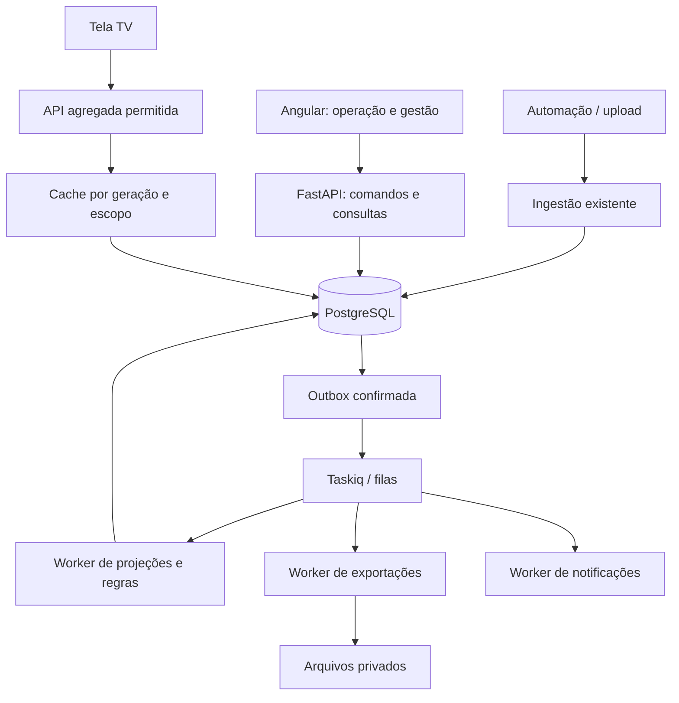

# 04 — Arquitetura de aplicação, APIs e processamento

[Índice](README.md) · [Indicadores e documentos](05-indicadores-relatorios-desempenho.md)

Todos os endpoints e JSONs novos abaixo são **propostas**, não contratos já disponíveis. Códigos legíveis como `CAS-2026-0042` servem à interface; IDs persistentes são UUIDs. Valores e personagens de exemplos são fictícios.

## 1. Arquitetura proposta



Manter um deploy de API e workers escaláveis independentemente, compartilhando módulos e banco. Separar filas de ingestão, exportação e notificações para um PPTX pesado não atrasar a atualização do scrap. No início, podem compartilhar processo com concorrência limitada, mas as filas e limites devem ser distintos.

Fronteiras sugeridas em `backend/src/modules`: `material_scrap` mantém ingestão/ocorrências; novos módulos `production`, `quality_cases`, `improvement_actions`, `governance_audits`, `reporting`, `business_alerts`. Infraestrutura compartilhada oferece armazenamento, outbox e trilha. Evitar mover todo o código antigo antes de entregar comportamento útil.

Serviço de comando controla transação. Repositórios fazem persistência sem `commit` interno quando participam de uma operação composta. Essa convenção deve ser introduzida progressivamente: hoje vários serviços existentes finalizam suas próprias transações.

## 2. Convenções de contrato

| Tema | Decisão proposta |
| --- | --- |
| Versionamento | Preservar API atual; novas rotas em `/api/v1` e contrato de ingestão v2 negociado separadamente |
| Dinheiro/quantidade decimal | Strings decimais, moeda e unidade explícitas |
| Datas | ISO 8601; timestamps com offset; dia produtivo acompanhado de calendário/fábrica |
| Concorrência | `expected_version` obrigatório em edição/transição; divergência retorna `409` |
| Criação repetível | `Idempotency-Key` por ator/escopo/operação; mesma chave com body distinto retorna `409` |
| Erros | Código estável, mensagem localizada, erros de campo e correlation ID; sem stack trace ao usuário |
| Listagem | Paginação no servidor, ordenação estável com ID de desempate e filtros permitidos |
| Trabalho pesado | `202 Accepted`, ID do job, progresso e endpoint de estado |
| Autorização | Backend deriva ator e escopo da sessão/chave; não aceita privilégio declarado pelo body |
| Lote | Prévia e resultado por item; atomicidade total ou parcial declarada no contrato |

Para grids comuns, manter paginação atual inicialmente. Para eventos/históricos grandes, preferir cursor `(created_at,id)`. “Selecionar todos” precisa registrar filtro e geração avaliados; não pode significar somente a página atual nem incluir silenciosamente itens surgidos depois.

## 3. Catálogo de endpoints por capacidade

Prefixo comum proposto: `/api/v1`.

| Área | Comandos e consultas | Quem pode usar |
| --- | --- | --- |
| Linhas | `GET/POST /production-lines`, `POST /production-lines/{id}/layout-versions` | Leitura conforme escopo; administração escreve |
| Produção | `GET /production-entries`, `PUT /production-lines/{id}/production/{date}`, `POST /production-entries/{id}/approve` | Apontador escreve; validador aprova |
| Regras | `POST /review-policies/{id}/versions`, `/simulate`, `/activate` | Coordenação/admin com capacidade específica |
| Triagem | `GET /review-queue`, `POST /occurrences/{id}/review-decisions` | Analista; override segue alçada |
| Casos | `POST/GET /cases`, `POST /cases/{id}/occurrences`, `/assign`, `/submit-analysis`, `/approve-analysis` | Analista e aprovador no escopo |
| Ações | `GET/POST /actions`, `PATCH /actions/{id}`, `POST /actions/{id}/transitions`, `/effectiveness-checks` | Responsável/gestor e validador |
| Relatórios | `POST /reports`, `POST /reports/{id}/versions`, `/submit`, `/publish`, `/withdraw` | Autor/aprovador conforme política |
| Exportação | `POST /exports`, `GET /exports/{id}`, `GET /artifacts/{id}/download` | Usuário autorizado ao documento/dataset |
| Distribuição | `POST /report-versions/{id}/distributions` | Capacidade explícita de envio e escopo validado |
| Auditoria | `POST/GET /audit-cycles`, `/population`, `/sample`, `/findings`, `/conclude` | Auditor/coordenação |
| Alertas | `GET /alerts`, `POST /alerts/{id}/acknowledge`, `/resolve`, `/read` | Destinatário ou gestor conforme ação |
| TV | `GET /tv/line-ranking`, `GET /tv/status` | Política de acesso público agregado vigente ou dispositivo autorizado |
| Trilha | `GET /audit-events` | Auditor/gestor no escopo; sem edição |

Adicionar endpoints aos testes e à matriz de acesso existente antes da ativação. A API pública da TV deve ter schema próprio com allowlist, e não serializar parcialmente uma resposta detalhada contando com campos escondidos na interface.

## 4. Produção manual: primeiro contrato a implementar

Exemplo de `PUT /production-lines/{line_id}/production/2026-09-04`, criando uma revisão de entrada. `expected_version: 0` representa célula ainda inexistente.

```json
{
  "expected_version": 0,
  "produced_quantity": "1200",
  "unit": "FINISHED_UNIT",
  "source": "MANUAL",
  "note": "Produção total confirmada no apontamento diário",
  "evidence_ids": ["e21884d4-212c-4ab6-89db-c27c3c44a754"]
}
```

Resposta proposta:

```json
{
  "entry_id": "13267666-a33b-4bf2-8fa6-17916c8fbab3",
  "version": 1,
  "status": "PENDING_APPROVAL",
  "production_date": "2026-09-04",
  "produced_quantity": "1200",
  "unit": "FINISHED_UNIT",
  "ranking_eligible": false,
  "reason_codes": ["PRODUCTION_NOT_APPROVED"]
}
```

Correção de 1.200 para 1.180 exige versão esperada e motivo; cria revisão 2, mantendo versão 1 aprovada até nova aprovação. Aprovação troca o ponteiro corrente, gera evento e invalida/recalcula métricas afetadas. O usuário não envia `approved_by`.

Para colagem/importação, adicionar prévia de lote: células novas, iguais, conflitantes, linhas desconhecidas e totais. Só aplicar após validar o resultado. Integração futura usa esse mesmo serviço e cria `source=ERP`/`MES`; conflito com manual aprovado exige política expressa de precedência.

## 5. Triagem e caso com decisão verificável

Exemplo de decisão de revisão; o backend calcula o resultado da política e valida a exceção pedida:

```json
{
  "expected_version": 3,
  "requested_disposition": "EXEMPT",
  "reason_code": "KNOWN_CONTROLLED_PROCESS",
  "justification": "Evento coberto pelo procedimento vigente e dentro do limite aprovado",
  "procedure_reference": "PROC-QUAL-17/v3",
  "policy_version_id": "4d369fbb-6777-4aab-9336-ef6f8f6c8f7a"
}
```

Caso a regra crítica exija análise, a resposta pode criar solicitação de exceção pendente, sem dispensar de imediato. Guardar tanto a avaliação automática quanto a decisão humana final.

Criação de caso com duas ocorrências:

```json
{
  "title": "Monitores danificados por objeto estranho na esteira",
  "factory_id": "58bc1b40-4383-4dcf-b5d0-62e3481ed729",
  "line_id": "83c56e64-a57b-46bf-8c4f-b6a1561d4f00",
  "occurrence_ids": [
    "b51b8c7f-31cb-421e-9572-c324cb02ade2",
    "c05a0ba4-22dd-492f-9fd4-12dc24631e25"
  ],
  "grouping_reason": "Mesmo incidente e mesma janela, confirmado pelo analista",
  "owner_user_id": 42,
  "risk": "HIGH",
  "affected_finished_units": "12",
  "affected_units_evidence_id": "e21884d4-212c-4ab6-89db-c27c3c44a754"
}
```

Rejeitar ocorrência de outra fábrica, vínculo principal ativo conflitante ou versão já substituída sem decisão consciente. `affected_finished_units` não altera quantidade do ERP nem entra automaticamente no ranking: precisa de definição de medição sem duplicação.

## 6. Ação e eficácia

```json
{
  "title": "Instalar proteção contra objetos na esteira A02",
  "origin": "CASE",
  "case_ids": ["d0197e4b-7f5f-40c5-95c8-9883c4b7c38b"],
  "owner_user_id": 51,
  "due_at": "2026-09-18T17:00:00-04:00",
  "risk": "HIGH",
  "four_m": "MACHINE",
  "effectiveness_plan": {
    "metric_code": "CONFIRMED_FOREIGN_OBJECT_INCIDENTS",
    "baseline_from": "2026-08-01",
    "baseline_to": "2026-08-31",
    "verification_from": "2026-09-19",
    "verification_to": "2026-10-16",
    "minimum_produced_units": "5000",
    "criterion": "NO_RECURRENCE_IN_VERIFICATION_WINDOW",
    "evaluator_user_id": 60
  }
}
```

Esse critério comprova atendimento da regra acordada, não causalidade estatística universal. A verificação guarda volume observado, cobertura, resultado e limitações. Mudança de janela posterior não deve selecionar só os dias favoráveis sem justificativa auditada.

Comando de movimento no Kanban:

```json
{
  "expected_version": 7,
  "to_status": "IMPLEMENTED",
  "reason": "Proteção instalada e inspecionada",
  "evidence_ids": ["e21884d4-212c-4ab6-89db-c27c3c44a754"]
}
```

O servidor valida transição e evidências. Se falhar, a interface devolve o cartão à posição anterior e mostra o motivo. Ordem visual de cartões é preferência/posição; não autoriza transição nem altera prioridade formal sozinha.

## 7. Publicação, exportação e snapshot

```json
{
  "report_version_id": "93aa6ec6-0a31-4ad5-93a3-4945a5a01bad",
  "formats": ["PDF", "PPTX", "XLSX", "CSV"],
  "locale": "pt-BR",
  "timezone": "America/Manaus",
  "template_version": "executive-v1",
  "include_private_evidence": true
}
```

Exemplo solicita formatos da mesma edição. Backend valida autorização para evidências e cria jobs filhos por formato. Erro em PPTX não exige regenerar PDF pronto. Publicação fixa o snapshot antes; um export de consulta avulsa também cria snapshot próprio e é rotulado “consulta”, não relatório aprovado.

Publicação atômica: validar versão/autoridade → fixar análise/dataset pronto → inserir evento de publicação e outbox → commit. Worker renderiza arquivos depois, fora da transação de publicação. Snapshot pendente impede publicar; geração de artefato pendente não deve invalidar um conteúdo já publicado.

Se a montagem do dataset for grande, capturá-lo em tarefa anterior. Na publicação, comparar o escopo/versões com a revisão submetida; mudança material exige revisão ou confirmação expressa da edição desatualizada, conforme política.

## 8. Evento e outbox

```json
{
  "event_id": "16b6d9ea-1ec5-42d2-aedf-528ec1d062de",
  "event_type": "production.entry_approved.v1",
  "occurred_at": "2026-09-05T12:15:00Z",
  "aggregate_type": "production_entry",
  "aggregate_id": "13267666-a33b-4bf2-8fa6-17916c8fbab3",
  "aggregate_version": 2,
  "factory_id": "58bc1b40-4383-4dcf-b5d0-62e3481ed729",
  "correlation_id": "cor-production-20260905-001",
  "payload": {
    "production_date": "2026-09-04",
    "line_id": "83c56e64-a57b-46bf-8c4f-b6a1561d4f00",
    "approved_version": 2
  }
}
```

Gravar alteração de domínio, trilha e outbox na mesma transação. Dispatcher envia eventos confirmados e registra tentativa; falha entre envio e marcação pode duplicar entrega. Consumidor usa recibo único por `(consumer_name,event_id)` e atualização idempotente. Não prometer execução exatamente uma vez.

Mudanças de produção, classificações e correções ERP invalidam partições analíticas. Eventos de caso/análise/ação alimentam alertas e governança. Outbox não substitui trilha de auditoria: pode ser compactada após entrega; a trilha segue política própria de retenção.

Retry usa backoff e limite, com fila de falhas inspecionável. Worker possui heartbeat, timeout, cancelamento cooperativo e recuperação de lease. Publicar job não deve depender exclusivamente de tarefa em memória do processo web.

## 9. Ingestão v2 e completude

Adicionar manifesto explicitamente versionado. Exemplo parcial de envelope v2 — não é payload completo nem compatível com o schema v1 atual, que rejeita campos extras:

```json
{
  "schema_version": "2.0.0",
  "coverage": [
    {
      "organization_code": "NW1",
      "transaction_date": "2026-09-04",
      "mode": "FULL_SNAPSHOT",
      "complete": true,
      "expected_rows": 0,
      "source_sequence": 18742
    }
  ]
}
```

Fonte autorizada e manifesto completo são pré-requisitos para publicar a partição vazia. `PARTIAL` adiciona/atualiza apenas itens identificáveis e nunca remove ausentes. Sequência deve vir da fonte com semântica acordada; se indisponível, definir precedência por extração e fluxo explícito de correção, sem presumir que horário de chegada significa dado mais novo.

Chunking futuro precisa declarar lote lógico, chunks esperados e checksum final. Não publicar cada chunk como snapshot completo. Manter limite de 50 mil linhas da v1 até implementar staging + confirmação do lote inteiro.

## 10. Falhas, acesso e operação

| Falha | Comportamento esperado |
| --- | --- |
| Dois analistas editam a mesma versão | Um comando vence; outro recebe `409` e comparação de versões |
| Worker cai após salvar arquivo | Retry detecta saída já existente pelo job/hash e conclui sem duplicar publicação |
| E-mail falha | Relatório permanece publicado; entrega apresenta erro e reenvio controlado |
| Redis indisponível | Consulta permitida pode ir ao banco; outbox fica pendente para processamento |
| Arquivo inválido/malicioso | Evidência em quarentena; não publicar nem servir em TV/relatórios |
| Usuário perde acesso após gerar export | Download revalida permissão; URL expira rapidamente |
| Nova geração analítica falha | Continuar servindo última geração válida com data e aviso de defasagem |

Retenção, backup/restauração, credenciais de serviço, limites de arquivo e observabilidade fazem parte da conclusão do sistema. Esses itens são requisitos de operação, não uma afirmação de falhas de segurança reproduzidas nesta análise.
