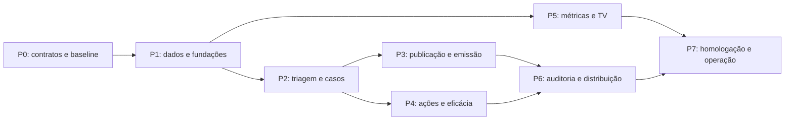

# 07 — Roadmap para terminar o sistema e critérios de aceite

[Índice](README.md) · [Diagnóstico](01-diagnostico.md)

Este roteiro transforma o plano em entregas executáveis. Cada etapa deve produzir uma fatia utilizável, com migração, permissões, testes e operação. Ordem é recomendação técnica; prazos dependem da equipe e do volume ainda não informados.

## 1. O que significa “sistema terminado”

Um analista consegue receber scrap, entender quais itens exigem análise, investigar um caso com vários registros, decidir ação ou justificar ausência dela, emitir uma edição rastreável e acompanhar as ações até eficácia. Um auditor consegue examinar população/amostra congelada e concluir ciclo com achados acompanháveis. Um gestor consegue consultar indicadores consistentes e emitir apresentações/planilhas. A TV compara todas as linhas elegíveis com produção aprovada e metodologia divulgada. A operação consegue recuperar falhas e restaurar dados/documentos.

Tela que mostra dados fixos, exportação somente visual, log chamado de auditoria ou coluna Kanban sem regra de transição não satisfaz esse aceite.

## 2. Dependências e entregas

P5 pode começar antes de P3/P4, mas ranking de eficácia depende das ações e não deve bloquear o primeiro ranking de custo/produção. A trilha de decisões e outbox entram em P1 e são usadas desde a primeira mutação nova, mesmo que a tela de consulta venha depois.

| Fase | Entrega observável | Dependências | Portão de saída |
| --- | --- | --- | --- |
| P0 — Contratos | Dicionário de métricas, papéis, estados, escopo e dados de homologação | Qualidade, produção e TI | Decisões essenciais registradas e exemplos calculados manualmente |
| P1 — Dados/fundações | Linhas, produção manual, histórico, evidência privada, trilha/outbox e proteção de publicação | P0 | Produção corrigível com histórico e origem conciliável |
| P2 — Triagem/casos | Fila real, políticas simuláveis, agrupamento e análise versionada | P1 | Incidente da esteira e dispensa funcionam ponta a ponta |
| P3 — Relatórios | Snapshot, edição, aprovação, PDF/CSV/XLSX e PPTX inicial | P2; adaptadores de export | Mesmo dataset reconciliado em todos os formatos |
| P4 — Ações | Kanban, responsáveis, prazos, bloqueios, evidências e eficácia | P2 | Conclusão não valida eficácia; falha/inconclusão têm tratamento |
| P5 — Analytics/TV | Métrica centralizada, grupos, cobertura, ranking e TV | P1; definições P0 | Todas as linhas aparecem, inelegíveis identificadas |
| P6 — Governança | Ciclos, população/amostra, achados, regras de alerta e distribuição | P3/P4 | Auditoria real concluída e relatório distribuível |
| P7 — Produção | Homologação, migrações, observabilidade, backup/restore e treinamento | P3–P6 | Aceite integrado e operação treinada |

## 3. Backlog técnico priorizado

Tamanhos relativos: S = escopo pequeno; M = várias camadas; L = alto acoplamento/regra; XL = dividir em fatias antes de planejar sprint. Não são dias nem promessa de prazo.

| ID | Prioridade/fase | Trabalho | Tamanho | Aceite verificável |
| --- | --- | --- | --- | --- |
| GOV-001 | P0 | Formalizar IF Cost, estornos, quantidades e metas | M | Exemplos de perda/estorno/zero fecham com a operação |
| GOV-002 | P0 | Mapear papéis e escopo de acesso | M | Matriz de leitura/escrita/aprovação validada |
| DATA-001 | P1 | Catálogo fábrica/linha e mapeamento de origem | M | Nenhum código desconhecido vira linha válida silenciosamente |
| DATA-002 | P1 | Produção manual versionada + aprovação | L | Correção preserva valor anterior e recalcula só após aprovação |
| DATA-003 | P1 | Manifesto completo/parcial/vazio e precedência | L | Lote parcial não retira ausentes; snapshot atrasado não vence recente |
| DATA-004 | P1 | Estratégia de identidade/ID ERP e substituição assistida | L | Correção monetária mantém proveniência da revisão antiga |
| DATA-005 | P1 | Classificações versionadas e reconstrução segura | L | Reclassificar não altera snapshot já publicado |
| CORE-001 | P1 | Trilha + outbox + recibos idempotentes | L | Rollback remove evento; retry não duplica efeito |
| CORE-002 | P1 | Armazenamento privado e ciclo de evidências | M | Upload inválido não vira anexo acessível |
| TRI-001 | P2 | Políticas de revisão, simulação e explicação | L | `REQUIRED`, `OPTIONAL`, `EXEMPT`, `UNDETERMINED` diferenciados |
| TRI-002 | P2 | Fila, atribuição, prazo e override aprovado | M | Dispensa não reduz perda financeira automaticamente |
| CASE-001 | P2 | Casos com vínculo de ocorrências | L | Um caso agrega origem sem somar em duplicidade |
| CASE-002 | P2 | Análises versionadas e migração de revisão legada | L | Edição submetida é reproduzível; legado não ganha aprovação fictícia |
| REP-001 | P3 | Snapshots, edições e publicação | L | Correção da fonte não muda edição publicada |
| REP-002 | P3 | Pipeline PDF/CSV/XLSX | L | Valores/contagens iguais aos do snapshot |
| REP-003 | P3 | PowerPoint executivo e template versionado | M | Arquivo abre, é legível e contém proveniência/corte |
| ACT-001 | P4 | Ações, vínculos, Kanban e transições | L | API bloqueia movimento inválido, independentemente do frontend |
| ACT-002 | P4 | Eficácia, baseline e resultado inconclusivo | L | Produção zero não valida sucesso; reabertura preserva histórico |
| ANA-001 | P5 | Serviço de métricas/escopo e metas | L | Período/filtro não compara linha com meta global indevida |
| ANA-002 | P5 | Rollup/MV conforme benchmark e geração coerente | M | Troca atômica; falha mantém última geração válida |
| TV-001 | P5 | Ranking normalizado, grupos e cobertura | M | Sem denominador não recebe posição competitiva |
| TV-002 | P5 | Tela TV, rotação e estado de defasagem | M | Todas as linhas acessíveis e legíveis no equipamento real |
| AUD-001 | P6 | Ciclos, população, amostra e parecer | L | População examinada não muda quando base corrente muda |
| AUD-002 | P6 | Achados, respostas e vínculo às ações | M | Fechamento preserva acompanhamento das pendências |
| ALR-001 | P6 | Alertas de negócio deduplicados e escalonamento | L | Leitura não resolve incidente; retry não gera tempestade |
| DIST-001 | P6 | Destinatários, distribuição e histórico por edição | M | Usuário revisa escopo; falha de entrega não altera publicação |
| OPS-001 | P7 | Observabilidade, limites e recuperação de worker | M | Falha ensaiada recupera sem duplicação/perda |
| OPS-002 | P7 | Backup/restore integrado banco + objetos | M | Restauração encontra relatórios/anexos e seus hashes |
| QA-001 | P7 | Homologação cruzada, acesso e performance | L | Cenários do item 5 aprovados |

Itens de integridade em P1 podem ser entregues por partes, mas a publicação oficial não deve ser ativada antes de proteger versões e proveniência. A integração automática da produção é uma etapa posterior que substitui o canal de entrada, não o domínio já entregue.

## 4. Divisão sugerida em PRs

Uma PR deve ter problema, comportamento final, migração, testes e limites de implantação. Evitar PR única com dezenas de tabelas, todas as telas e troca de identidade.

Sequência inicial sugerida: contratos e fixtures de negócio → catálogo e mapeamentos → produção API/schema → produção interface → histórico/outbox → política de triagem → casos/análise → snapshot/publicação → primeiro renderer → Kanban → eficácia → indicadores/TV → auditoria → distribuição.

Quando uma entrega tiver partes backend/frontend independentes, manter feature flag até contrato e tela estarem prontos. Migração expansiva entra antes do consumidor; remoção de coluna/rota acontece em PR posterior, com compatibilidade documentada.

Cada implementação deve partir de uma base de branch confirmada e usar commits/PRs de escopo revisável, com sequência de migrações compatível com as outras entregas em andamento.

## 5. Matriz de testes que demonstra conclusão

| Cenário | Tipo de validação | Resultado obrigatório |
| --- | --- | --- |
| Mesmo lote enviado duas vezes | Integração PostgreSQL/worker | Um efeito lógico, mesma proveniência, sem duplicar perda |
| Janelas sobrepostas | Integração | Ocorrências e valores atuais corretos por partição |
| Snapshot completo vazio | Integração | Retira apenas partição autorizada e registra motivo |
| Upload parcial de uma linha | Integração | Não apaga outras ocorrências do dia |
| Extração antiga chega depois | Concorrência | Preserva revisão mais recente segundo precedência |
| Quantidade/valor corrigidos | Domínio + migração | Substituição/identidade tratadas; análise antiga acessível |
| Reclassificação em paralelo à ingestão | Concorrência PostgreSQL | Projeção publicada coerente e sem perda de fatos |
| Dispensa elegível | API/UI | Decide e registra; permanece na métrica quando incluída |
| Override de crítico sem alçada | API | Rejeitado ou pendente de aprovação, nunca dispensado imediatamente |
| Duas edições concorrentes | API | `409`, sem sobrescrever silenciosamente |
| Caso com várias ocorrências e ações | Domínio/analytics | Custo distinto uma vez; benefício não duplicado |
| Relatório publicado recebe correção de origem | Integração/artefato | Bytes/valores antigos preservados; nova edição identificável |
| Revisão legada migrada | Migração | Conteúdo preservado, sem inventar aprovação histórica |
| Ação sem evidência tenta avançar | API/UI | Bloqueia transição e mantém cartão coerente |
| Janela de eficácia sem produção | Domínio | Resultado inconclusivo |
| Produção manual corrigida/importada | Integração | Histórico, aprovação e reconciliação explícitos |
| Linha sem denominador | Analytics/TV | Visível, inelegível, sem posição falsa |
| Período com dia faltante | Analytics | Cobertura explícita; numerador/denominador alinhados |
| Estorno e quantidade heterogênea | Unidade/contrato | Métrica apropriada, sem taxa falsa de produtos |
| Virada do ano/semana ISO/meta zero | Unidade | Janela correta e resultado indefinido tratado |
| Todos os formatos | Reconciliação + inspeção visual | Mesma edição, totais e corte; sem tabela/foto ilegível |
| Export com texto interpretável como fórmula | Artefato | Conteúdo textual não executa fórmulas |
| Worker cai no meio da geração | Integração | Retry seguro, sem arquivos/edições duplicados |
| Usuário de outra fábrica/sem permissão | API e download | Não acessa caso, foto, export ou escopo alheio |
| Auditoria reaberta/base corrigida | Domínio | População/parecer anterior preservados |
| Falha SMTP/alerta reavaliado | Worker | Entrega rastreável e deduplicada |
| Backup restaurado | Ensaio operacional | Banco e objetos coerentes; acesso e históricos recuperados |

Reaproveitar testes existentes de ingestão/revisão/dashboard e acrescentar cenários acima. Rodar testes com PostgreSQL real para locks, constraints e isolamento: SQLite não demonstra as mesmas garantias. Nesta entrega documental não foram executados testes da aplicação.

Para arquivos, validar estrutura abrindo com leitores reais de homologação e renderizar páginas/slides para inspeção. Validação de ZIP/XML ou resposta HTTP 200, isoladamente, não garante legibilidade de PDF/PPTX/XLSX.

## 6. Estratégia de migração e implantação

### Expansão

Criar schema novo, flags e adapters sem remover o modelo antigo. Fazer backup verificado e registrar versão de deploy. Rodar backfill por lote com checkpoints e métricas de progresso; operação idempotente permite retomar. Não recalcular IDs antigos em massa sem mapa auditável.

### Comparação

Construir relatórios de reconciliação: contagens por dia/linha, valores BRL/USD, ocorrências sem mapeamento, revisões órfãs, anexos ausentes, divergências de inclusão e produção pendente. Cada diferença deve ter causa e decisão, não apenas tolerância global que esconde erros locais.

### Piloto

Ativar uma fábrica/um grupo de linhas e poucos analistas. Começar com indicadores em paralelo e ranking preliminar. Medir erros, tempo por caso, pendências e qualidade de produção. Treinar responsáveis de ação e auditor antes de ampliar.

### Corte e reversão

Trocar leitura/escrita por flag após aceite. Para regressão de interface/consulta, voltar consumidor à versão anterior compatível. Para erro de dados, pausar publicação e corrigir por migração/reprocessamento controlado; não descartar novas decisões só para voltar o código. Banco/objetos têm plano conjunto de restauração e reconciliação.

Manter prazo de compatibilidade definido pela equipe. Remover legado apenas depois de confirmar redirecionamentos, exports, permissões e ausência de consumidores antigos.

## 7. Operação e governança técnica

| Tema | Entrega necessária |
| --- | --- |
| Observabilidade | Correlação RPA→ingestão→projeção→caso→export; métricas de lag, fila, erro e duração |
| Disponibilidade | Readiness de API/worker, última geração válida, retries limitados e procedimento de recuperação |
| Arquivos | Armazenamento privado persistente, hash, tamanho/MIME, limite, quarentena e coleta de órfãos |
| Retenção | Política por bruto, evidência, documento, evento e export temporário; bloqueio por investigação quando aplicável |
| Backup | Banco e objetos; restaurar em ambiente isolado e validar amostra de relatórios |
| Capacidade | Benchmarks com volume e concorrência definidos; limites de export/upload e quotas |
| Acesso | Capacidade por escopo e usuário; revalidação em downloads e envio |
| Trilha | Eventos append-only para o papel da aplicação; acesso administrativo separado e monitorado |
| Integridade documental | Edição imutável, checksum e cadeia de retificações; hash sozinho não torna armazenamento inviolável |
| Atendimento | Runbooks para falha RPA, produção atrasada, export travado, alerta em excesso e inconsistência de ranking |

Definir RPO/RTO com TI antes da produção; ponto de partida a negociar pode ser RPO 24 h e RTO 4 h, nunca promessa sem ensaio. Se a perda aceitável de decisões for menor, ajustar backup/logs e custo de operação. Papel de runtime não deve poder editar a trilha; administrador do banco ainda exige controles externos e revisão operacional.

Usar políticas de armazenamento imutável externo quando houver exigência formal; não implementar blockchain ou event sourcing completo só para ter histórico. Outbox + estados relacionais + versões publicadas resolvem o objetivo inicial com menor complexidade.

## 8. Critérios de aceite por área de negócio

- **Qualidade:** regras de obrigatoriedade compreensíveis, exceção rastreável, caso com vários lançamentos, evidência e decisão sem ação válidas.
- **Produção:** cadastro de linhas e entrada manual usáveis; correção com histórico; responsabilidade pelos denominadores definida.
- **Melhoria contínua:** cada ação tem dono/prazo, impedimentos visíveis e verificação independente conforme risco.
- **Auditoria:** ciclo, população, amostra, achados e parecer disponíveis; documentos examinados preservados.
- **Gestão:** relatório e apresentação respondem perda, tendência, causa, ações e decisões; números batem entre formatos.
- **TV:** todas as linhas aparecem, comparação justa, dados faltantes explícitos e leitura validada à distância.
- **TI:** operação pode recuperar filas/arquivos, restaurar backup, observar defasagem e gerir acesso.

## 9. Decisões que faltam validar, sem impedir o planejamento

| Decisão | Dono sugerido | Momento-limite |
| --- | --- | --- |
| Significado exato de IF Cost e estornos | Controladoria + Qualidade | Antes de congelar métrica oficial |
| Fonte/grão de quantidade de produtos afetados | Qualidade + produção | Antes de publicar taxa de defeitos |
| Definição de produção e validador da entrada manual | Produção | Antes de ativar ranking |
| Limites de obrigatoriedade e alçadas | Qualidade | Antes de ativar política automática |
| Cadência, escopo e método de auditoria | Coordenação/auditoria | Antes do primeiro ciclo |
| Catálogo real de fábricas, linhas e grupos comparáveis | Produção | Antes do piloto |
| Volume, usuários simultâneos e infraestrutura | TI | Antes de aprovar metas de desempenho |
| Retenção, distribuição e visibilidade financeira na TV | Gestão + TI | Antes de publicar/compartilhar externamente ao grupo permitido |
| Template de relatório/PPTX e idiomas | Gestão | Antes da homologação dos formatos |

## 10. O que pode ficar para depois da primeira versão completa

Integração automática de produção, editor visual sofisticado de mapas, inferência assistida de causa, previsão de scrap, detecção estatística avançada e data warehouse são extensões. Não devem bloquear revisão seletiva, emissão confiável, ações, auditoria e TV básica.

Não adiar fundamentos como histórico de edição, identidade, unidade do indicador, acesso ou snapshot esperando uma segunda versão: eles sustentam a confiança no sistema inteiro.

## 11. Checklist final de liberação

- [ ] Todos os módulos contratados usam dados reais e APIs persistentes.
- [ ] Revisão obrigatória/opcional/dispensada é distinguível e auditável.
- [ ] Caso → análise → relatório → ação → eficácia funciona ponta a ponta.
- [ ] Auditoria periódica possui população, amostra, achados e conclusão.
- [ ] Produção manual aprovada alimenta ranking com cobertura e unidade corretas.
- [ ] PDF/PPTX/CSV/XLSX foram emitidos, reconciliados e inspecionados.
- [ ] Revisões e documentos antigos permanecem acessíveis após correção.
- [ ] Usuários só leem/alteram/exportam o escopo autorizado.
- [ ] Falha de fonte/worker/e-mail não inventa sucesso nem zero.
- [ ] Migração foi ensaiada, diferenças explicadas e reversão definida.
- [ ] Backup/restauração e monitoramento foram testados.
- [ ] Usuários-chave concluíram os cenários de homologação e registraram aceite.
