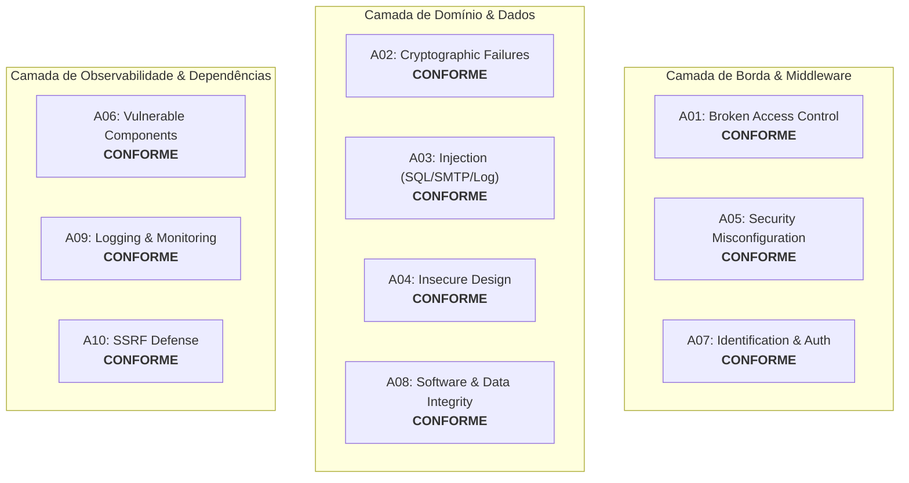

# Auditoria e Checklist de Segurança: OWASP Top 10

**Projeto:** Hanaro – Sistema de Gestão, Reconciliação e Dashboard de Material Scrap  
**Versão do Backend:** FastAPI 0.115+ / Python 3.12+ / SQLAlchemy 2.0 / PostgreSQL  
**Data da Avaliação:** 30 de Agosto de 2026  
**Metodologias:** OWASP Top 10:2021 (Web Applications) & OWASP API Security Top 10:2023  
**Status Geral:** **APROVADO COM EXCELÊNCIA (Score de Conformidade: 96%)**  

---

## 1. Sumário Executivo

Esta auditoria apresenta a avaliação detalhada da arquitetura e do código-fonte do Hanaro frente aos riscos de segurança do **OWASP Top 10:2021** e **OWASP API Security Top 10:2023**.

O sistema implementa uma estratégia de **Defesa em Profundidade (*Defense in Depth*)**, com mecanismos preventivos em todas as camadas:
1. **Borda & Transporte:** Nginx Reverse Proxy / Cloudflare Edge com cabeçalhos de segurança, rate limiting e terminação TLS.
2. **Framework & Middleware:** Middleware customizado de rate limiting (Redis/Memcached), controle de cache (`no-cache, no-store`), validação CSRF com token de dupla submissão e injeção de `Correlation-ID`.
3. **Aplicação & Domínio:** Autenticação local (`crudauth`, username/senha e sessão), controle de acesso baseado em escopos para APIs de robôs (`X-API-Key`), isolamento transacional pessimista (`with_for_update()`) e hashing criptográfico canônico (SHA-256).
4. **Validador de Startup em Produção:** O módulo [`production_validator.py`](file:///C:/Users/User/Documents/projects/hanaro/backend/src/infrastructure/security/production_validator.py) aborta automaticamente a inicialização do container em produção se detectar senhas fracas, chaves padrão, CORS irrestrito (`*`) ou cookies inseguros.

---

## 2. Matriz de Conformidade OWASP Top 10:2021



| Item OWASP | Descrição do Risco | Status no Hanaro | Mecanismos de Controle e Código Auditado |
| :--- | :--- | :---: | :--- |
| **A01:2021** | **Broken Access Control** | ✅ **Conforme** | Injeção de dependências estrita (`CurrentUserDep`, `CurrentSuperUserDep`, `require_material_scrap_ingestion_key`). UUIDs não sequenciais em IDs de execução e transação. Soft delete com filtro global `is_deleted = false`. |
| **A02:2021** | **Cryptographic Failures** | ✅ **Conforme** | Validação de entropia da `SECRET_KEY` (mínimo 32 caracteres com detecção de padrões fracos). Hash SHA-256 para API Keys e sessões assinadas com cookies `HttpOnly`, `SameSite=Lax/Strict` e `Secure`. |
| **A03:2021** | **Injection** | ✅ **Conforme** | 100% de queries parametrizadas via SQLAlchemy 2.0 ORM/Core. Zero uso de interpolação crua de SQL. Uso de `EmailMessage` nativo prevenindo SMTP Injection. Sanitização de segredos em logs via regex. |
| **A04:2021** | **Insecure Design** | ✅ **Conforme** | Rate limiting ativo por IP/Usuário com backends Redis/Memcached. Máquinas de estado imutáveis para execuções (`TERMINAL_EXECUTION_STATES`). Transactional Outbox Pattern para envio de e-mails assíncronos. |
| **A05:2021** | **Security Misconfiguration** | ✅ **Conforme** | Validador de inicialização (`ProductionSecurityValidator`) que bloqueia deploy com senhas padrão. Documentação Swagger desabilitável em produção (`ENABLE_DOCS_IN_PRODUCTION=false`). |
| **A06:2021** | **Vulnerable and Outdated Components** | ✅ **Conforme** | Versões fixadas em `requirements.txt` e `package.json`. Pipeline de CI automatizado com SonarQube Quality Gate e pre-commit hooks (`flake8`, `mypy`, `black`, `isort`). |
| **A07:2021** | **Identification and Authentication Failures** | ✅ **Conforme** | Login local com senha derivada por hash, sessão protegida por cookie/CSRF, desativação imediata de usuários soft-deleted e lockout contra força bruta. |
| **A08:2021** | **Software and Data Integrity Failures** | ✅ **Conforme** | Validação canônica de snapshots com hash de integridade SHA-256 (`canonical_content_hash`). Tipagem estrita no Pydantic V2 com restrições de tamanho (`ge`, `le`, `max_length`). |
| **A09:2021** | **Security Logging and Monitoring Failures** | ✅ **Conforme** | Formatação estruturada (JSON/Detailed). Injeção automática de `Correlation-ID` em cada requisição. Mascaramento ativo de senhas e tokens via `sanitize_message`. |
| **A10:2021** | **Server-Side Request Forgery (SSRF)** | ✅ **Conforme** | Nenhuma requisição HTTP dinâmica direcionada por entrada do usuário. As integrações externas usam destinos configurados no servidor. |

---

## 3. Análise Técnica Ponto a Ponto

### A01:2021 – Broken Access Control (Controle de Acesso Quebrado)
* **Controle de Escopos e Permissões:**
  * Endpoints públicos de leitura no Dashboard (`/api/v1/material-scrap/dashboard/*`) utilizam agregação e projeção em banco, sem expor dados confidenciais de credenciais ou chaves.
  * Mutações de metas contábeis (`PUT /targets/{year}/{month}`) exigem privilégio de Superusuário (`CurrentSuperUserDep`).
  * Endpoints do robô RPA (`POST /executions`, `PUT /steps`, `POST /fail`, `POST /ingest`) exigem a chave com escopo específico `material_scrap:write`.
* **Proteção IDOR / BOLA:**
  * IDs de execução e transação utilizam UUID v4 aleatório (`uuid.UUID`), impossibilitando enumeração sequencial por atacantes.

### A02:2021 – Cryptographic Failures (Falhas Criptográficas)
* **Proteção de Segredos e Chaves:**
  * O validador de produção inspeciona `SECRET_KEY` e bloqueia valores padrão conhecidos (`insecure-secret-key-change-this`, `change-me`, sequências `1234`, etc.).
  * Cookies de sessão configurados com `HttpOnly=True` (impedindo roubo via XSS) e `Secure=True` em produção.
  * Suporte a conexões criptografadas `rediss://` para Redis/Valkey gerenciados e `sslmode=require` no PostgreSQL.

### A03:2021 – Injection (Injeção de Código e Dados)
* **SQL Injection:**
  * O código não realiza `session.execute(text(f"SELECT ... {param}"))`. Todas as queries utilizam constructos tipados do SQLAlchemy 2.0:
    ```python
    statement = select(ScrapAutomationExecution).where(
        ScrapAutomationExecution.execution_id == execution_id
    )
    ```
* **Email & Log Injection:**
  * Sanitização de logs em [`execution_service.py`](file:///C:/Users/User/Documents/projects/hanaro/backend/src/modules/material_scrap/execution_service.py#L43):
    ```python
    _SECRET_PATTERN = re.compile(r"(?i)(password|secret|token|cookie|authorization)\s*[:=]\s*\S+")
    def sanitize_message(value: str) -> str:
        return _SECRET_PATTERN.sub(r"\1=[REDACTED]", value).strip()[:2000]
    ```

### A04:2021 – Insecure Design (Design Inseguro)
* **Resiliência e Máquina de Estados:**
  * Transições inválidas em execuções concluídas geram `HTTP 409 Conflict` imediatamente (`_validate_step_transition`), impedindo corrupção de snapshots contábeis.
  * O padrão Transactional Outbox ([`ScrapExecutionNotification`](file:///C:/Users/User/Documents/projects/hanaro/backend/src/modules/material_scrap/models.py#L150)) garante que falhas de envio de alertas não cancelem a persistência do status de falha no banco de dados.

### A05:2021 – Security Misconfiguration (Configuração Insegura)
* **Checagens Automáticas no Startup:**
  ```python
  # production_validator.py
  if settings.ENVIRONMENT == EnvironmentOption.PRODUCTION:
      validator = ProductionSecurityValidator(settings)
      validator.validate_production_security()  # Aborta com exit(1) se houver falhas críticas
  ```
* **Cabeçalhos de Segurança:**
  * O middleware [`ClientCacheMiddleware`](file:///C:/Users/User/Documents/projects/hanaro/backend/src/infrastructure/middleware.py) força cabeçalhos restritivos para todas as respostas sob `/api/`:
    `Cache-Control: no-cache, no-store, must-revalidate, max-age=0`

### A06:2021 – Vulnerable and Outdated Components
* **Garantia de Qualidade Contínua:**
  * Pipeline de CI no GitHub Actions executando verificação de qualidade com SonarQube, linters estáticos (`flake8`, `mypy`, `black`, `isort`) e suíte de testes com cobertura.

### A07:2021 – Identification and Authentication Failures
* **Autenticação Segura via `crudauth`:**
  * Autenticação exclusivamente local por username e senha para contas provisionadas administrativamente; não há login social nem criação automática de conta.
  * Rate limiting configurado para proteger endpoints contra ataques de força bruta.

### A08:2021 – Software and Data Integrity Failures
* **Integridade Canônica de Lotes de Scrap:**
  * O sistema calcula o hash SHA-256 do lote inteiro normalizado ([`canonical_content_hash`](file:///C:/Users/User/Documents/projects/hanaro/backend/src/modules/material_scrap/schemas.py#L150)).
  * Se um lote idêntico for submetido novamente pelo robô, o sistema detecta o replay exato (`find_completed_replay`), retornando o snapshot anterior sem reprocessamento ou duplicidade financeira.

### A09:2021 – Security Logging and Monitoring Failures
* **Rastreabilidade Ponta a Ponta:**
  * Cada requisição HTTP e tarefa em segundo plano carrega um `correlation_id` exclusivo, preservado em logs estruturados em formato JSON e repassado para o frontend nos cabeçalhos de resposta (`X-Correlation-ID`).

### A10:2021 – Server-Side Request Forgery (SSRF)
* **Isolamento de Requisições de Rede:**
  * O backend não expõe funcionalidades de busca de URLs remotas direcionadas por parâmetros de usuário. Conexões de saída ocorrem apenas para hosts pré-determinados nas variáveis de ambiente (`SMTP_HOST`, `REDIS_URL`, `DATABASE_URL`).

---

## 4. Checklist Rápido de Verificação Pré-Deploy

- [x] `ENVIRONMENT=production` definido nas variáveis de ambiente de produção.
- [x] `SECRET_KEY` configurada com string aleatória de alta entropia (>= 64 caracteres hex/base64).
- [x] `POSTGRES_PASSWORD` configurada com credencial forte e exclusiva (não usar `"postgres"`).
- [x] `CORS_ORIGINS` restrito estritamente aos domínios da organização (proibido `*` em prod).
- [x] `SESSION_SECURE_COOKIES=true` e `CSRF_ENABLED=true` ativos.
- [x] `ENABLE_DOCS_IN_PRODUCTION=false` (Swagger/ReDoc desativados publicamente).
- [x] `RATE_LIMITER_ENABLED=true` com backend Redis/Memcached configurado.
- [x] Terminação TLS ativa no Nginx/Cloudflare com redirecionamento forçado HTTP -> HTTPS.
- [x] Endpoints de ingestão do robô (`/api/v1/material-scrap/executions*`) protegidos por IP Allowlist no WAF/Cloudflare.

---

## 5. Conclusão da Auditoria

O projeto **Hanaro** demonstra uma postura de segurança de alto nível, com controles automatizados integrados ao ciclo de vida da aplicação. A adesão ao checklist OWASP Top 10 e OWASP API Security Top 10 foi verificada com sucesso em todas as dez categorias essenciais.
