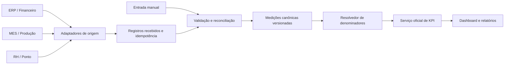

# Plano de ativação do KPI de eficiência relativa

Data do plano: 18/09/2026. Status: proposta de implementação; nenhuma funcionalidade descrita neste documento está sendo considerada pronta apenas por estar planejada.

## 1. Objetivo

Ativar a visão de **eficiência relativa** já existente no dashboard usando dados de produção informados manualmente em uma nova aba de Configurações. O primeiro incremento deve ser útil mesmo sem integração com sistemas externos e, ao mesmo tempo, preservar um caminho claro para substituir a digitação por integrações com produção, financeiro e, quando houver um indicador que realmente precise disso, RH.

O resultado inicial esperado é:

- calcular a proporção entre IF Cost e valor da produção no período;
- calcular a proporção entre quantidade de scrap e quantidade produzida, quando os dois valores forem compatíveis;
- comparar períodos usando taxas normalizadas, sem favorecer artificialmente uma linha ou um mês apenas porque produziu mais ou menos;
- informar de forma explícita quando o KPI não puder ser calculado por ausência, granularidade ou incompatibilidade dos dados;
- permitir que um usuário autorizado cadastre, revise e audite os denominadores manualmente.

## 2. Diagnóstico do que existe hoje

A interface do dashboard já possui a alternância entre valor absoluto e eficiência relativa. O frontend também contém uma fórmula preliminar:

```text
taxa atual = numerador atual / denominador atual × 100
taxa de referência = numerador de referência / denominador de referência × 100
variação = (taxa atual - taxa de referência) / taxa de referência × 100
```

Entretanto, a resposta atual da API não entrega denominadores de produção. No mapeamento do frontend, os campos `materialAmountUsd`, `productionQty` e seus equivalentes do ano anterior são preenchidos com zero. Por isso, a visão relativa existe visualmente, mas não possui dados reais para funcionar.

Há ainda três lacunas associadas:

1. O ranking relativo por linha recebe `relativeUsd` e `relativeQty` como indefinidos.
2. O backend retorna somente realizado, ano anterior e meta nas séries mensal e semanal.
3. O código usa o nome `materialAmountUsd` e a interface mostra “Valor do material”, enquanto a necessidade descrita é usar **valor da produção**. Esses conceitos não devem ser tratados como sinônimos sem uma confirmação de negócio.

O projeto já possui `gov_production_versions`, com quantidade por linha e dia, revisão, origem e aprovação. A persistência existe, mas ainda falta operacionalizar serviço, API e tela para que ela alimente o dashboard. Não existe estrutura equivalente implementada para o valor monetário da produção.

## 3. Definição proposta para os indicadores

### 3.1. Indicador financeiro principal

Nome recomendado na interface: **IF Cost sobre valor da produção**.

```text
taxa financeira (%) = IF Cost elegível no escopo / valor da produção no mesmo escopo × 100
```

Exemplo: IF Cost de USD 20.000 e produção de USD 2.000.000 resultam em 1%.

Direção favorável: **menor é melhor**.

Antes da implementação, Qualidade e Financeiro devem confirmar se o denominador oficial é realmente valor da produção. Se o conceito correto for valor de material consumido, custo padrão ou receita, ele deve possuir outro nome, outra fonte e outra definição. O plano assume **valor da produção** porque essa foi a intenção mais recente informada.

### 3.2. Indicador físico complementar

Nome recomendado na interface: **Scrap sobre produção**.

```text
taxa física (%) = quantidade elegível de scrap / quantidade produzida compatível × 100
```

Esse percentual só é válido se numerador e denominador representarem unidades compatíveis. Quantidade de componentes descartados não deve ser dividida por quantidade de produtos acabados e apresentada como “percentual de produtos defeituosos”. Quando as unidades forem diferentes, a alternativa correta pode ser uma razão como “peças descartadas por 1.000 unidades produzidas”, com nome e escala próprios.

### 3.3. Comparação ponderada correta

Para consolidar vários meses ou linhas, o sistema deve somar numeradores e denominadores antes de dividir:

```text
taxa consolidada = soma dos numeradores / soma dos denominadores × 100
```

Não deve calcular uma média simples das taxas mensais. Esse é o mecanismo que torna a comparação ponderada pela produção.

### 3.4. Regras obrigatórias

- Numerador e denominador devem usar o mesmo período, fábrica, linha e demais dimensões aplicáveis.
- Ausência deve ser armazenada e devolvida como `null`, nunca convertida silenciosamente em zero.
- Denominador zero torna a taxa não calculável; não deve gerar infinito nem `0%` fictício.
- O backend deve produzir a taxa oficial; o frontend apenas apresenta os valores e estados recebidos.
- Valores monetários devem preservar `Decimal`, moeda, precisão e origem. Arredondamento ocorre apenas na apresentação.
- A comparação com ano anterior exige denominadores cadastrados também no período de referência.
- Uma taxa parcial só pode ser exibida com cobertura explícita e nunca como resultado definitivo.

## 4. Escopo funcional do primeiro incremento

O primeiro incremento deve ativar a eficiência relativa consolidada por **mês e ano**, usando entrada manual global. Isso permite entregar valor rapidamente e reaproveitar a grade anual já usada para metas.

Incluído no MVP:

- valor mensal da produção em USD;
- quantidade mensal produzida na medida física padronizada do MVP, quando disponível;
- seleção de ano, permitindo preencher o período atual e o ano de referência;
- origem manual, observação, responsável, data de atualização e revisão;
- validação, salvamento em lote e leitura pelo dashboard;
- cálculo consolidado para mês selecionado e acumulado do ano;
- estado de cobertura completa, parcial ou ausente;
- acesso somente leitura para quem não puder editar;
- trilha mínima de alterações.

Não incluído no primeiro incremento:

- cálculo semanal a partir de um total mensal;
- distribuição artificial do valor global entre linhas;
- ranking relativo por linha sem denominadores por linha;
- integração automática com ERP, MES, financeiro ou RH;
- aprovação multinível e reconciliação automática de conflitos;
- novos indicadores de produtividade por hora ou pessoa.

Quando o usuário escolher semana, linha, produto, modelo ou outro filtro mais detalhado do que o denominador disponível, a API deve responder que a granularidade não é suportada. A interface deve manter o valor absoluto disponível e explicar por que o relativo não pode ser calculado.

## 5. Nova aba de Configurações

Nome recomendado: **Produção e eficiência**.

Essa aba deve ficar ao lado de “Metas”, pois as duas áreas alimentam cálculos do dashboard e compartilham padrões de seleção anual, tabela mensal, feedback e salvamento em lote.

### 5.1. Cabeçalho da aba

O cabeçalho deve conter:

- título e uma explicação curta sobre o uso dos dados;
- seletor de ano;
- escopo visível, inicialmente “Consolidado global”;
- moeda do valor da produção, inicialmente USD;
- estado da cobertura, por exemplo “10 de 12 meses informados”;
- última atualização e responsável;
- indicação clara de leitura ou edição.

### 5.2. Grade mensal

Cada linha representa um mês e contém:

| Campo | Obrigatoriedade | Regra |
| --- | --- | --- |
| Mês | Fixo | Janeiro a dezembro do ano selecionado |
| Valor da produção | Necessário para a taxa financeira | Decimal não negativo, moeda explícita |
| Quantidade produzida | Necessário para a taxa física | Decimal não negativo; ausência é diferente de zero |
| Unidade | Obrigatória quando houver quantidade | Ex.: `FINISHED_UNIT`; não permitir mistura silenciosa |
| Estado | Obrigatório | Ausente, rascunho ou confirmado no MVP |
| Observação | Opcional | Justificativa, fechamento ou ressalva da fonte |

A grade deve aceitar edição célula a célula e colagem de uma coluna vinda de planilha. Antes de salvar uma colagem, deve mostrar quantos valores serão criados, alterados ou rejeitados.

### 5.3. Ações

- **Salvar alterações:** faz upsert em lote com controle de versão.
- **Descartar alterações locais:** retorna ao último estado persistido.
- **Copiar ano anterior:** preenche um rascunho, nunca confirma automaticamente.
- **Limpar mês:** transforma o dado em ausente após confirmação; não grava zero.
- **Ver histórico:** mostra versões, origem, autor, data e justificativa.

O botão principal deve ficar desabilitado quando nada mudou ou quando existirem erros. Erros por mês devem permanecer ao lado da célula; um banner geral sozinho não é suficiente.

### 5.4. Resumo lateral ou superior

A aba pode apresentar um resumo compacto, sem duplicar o dashboard:

- total anual informado;
- meses completos e pendentes;
- taxa financeira estimada com o IF Cost já disponível;
- taxa física estimada, quando compatível;
- aviso de que valores em rascunho ainda não alimentam o resultado oficial.

Esse resumo serve para validar a digitação. Ele deve usar o mesmo endpoint de prévia ou o mesmo serviço de cálculo do dashboard, evitando uma segunda implementação da fórmula no componente.

## 6. Estados e comportamento da interface

| Estado | Comportamento esperado |
| --- | --- |
| Carregando | Skeleton da grade; não exibir zeros provisórios |
| Primeiro uso | Explicar quais dados faltam e oferecer iniciar preenchimento |
| Parcial | Permitir salvar e mostrar cobertura; KPI oficial fica indisponível ou explicitamente parcial |
| Completo | Mostrar confirmação, cobertura e última revisão |
| Sem permissão | Grade somente leitura e explicação do perfil necessário |
| Erro de validação | Preservar toda a edição local e apontar as células inválidas |
| Conflito de versão | Informar que outro usuário alterou os dados; permitir comparar e recarregar |
| Falha ao salvar | Não limpar o formulário; permitir tentar novamente |
| Denominador zero | Registrar somente quando zero for um fato confirmado; KPI fica não calculável |
| Granularidade incompatível | Manter visão absoluta e explicar o filtro incompatível |

Zero confirmado significa que não houve produção. Campo vazio significa que a informação não foi fornecida. Essa distinção deve existir no banco, no contrato, no formulário e no dashboard.

## 7. Persistência e modelo de domínio

### 7.1. Reaproveitamento obrigatório

`gov_production_versions` deve continuar sendo a fonte canônica de quantidade produzida por linha/dia. Ela já possui revisão, origem, status e aprovação. Não deve surgir uma segunda tabela de quantidade diária concorrente apenas para atender ao dashboard.

No MVP mensal global, há duas opções seguras:

1. agregar versões diárias aprovadas quando já existirem; ou
2. persistir o total mensal manual em uma medição de escopo global, claramente identificada como total agregado e sem fingir detalhamento por linha.

A segunda opção permite a entrega parcial solicitada. Quando a entrada por linha/dia for operacionalizada, o resolvedor de denominadores deve preferir a fonte detalhada aprovada e impedir dupla contagem com o total global.

### 7.2. Nova entidade recomendada

Criar `gov_metric_measurement_versions` para medições agregadas que não cabem em `gov_production_versions`, incluindo o valor da produção e futuros denominadores. Campos propostos:

| Campo | Finalidade |
| --- | --- |
| `id` | Identidade da versão |
| `metric_code` | `PRODUCTION_VALUE`, `PRODUCTION_QUANTITY`, `WORKED_HOURS` ou `HEADCOUNT` |
| `period_start` / `period_end` | Intervalo fechado representado pela medição |
| `grain` | Inicialmente `MONTH` |
| `scope_type` / `scope_id` | `GLOBAL`, `FACTORY` ou `LINE`; MVP usa `GLOBAL` |
| `value` | `Numeric(24,6)`, não negativo |
| `unit` | `USD`, `FINISHED_UNIT`, `HOUR`, `PERSON` etc. |
| `revision` | Controle monotônico por chave lógica |
| `status` | `DRAFT`, `CONFIRMED` ou `SUPERSEDED` |
| `source` | `MANUAL`, `IMPORT`, `ERP`, `MES`, `FINANCE` ou `HRIS` |
| `source_system` / `source_reference` | Proveniência externa e idempotência |
| `note` | Justificativa ou ressalva |
| `author_id` / `confirmed_by_id` | Responsabilidade |
| `created_at` / `confirmed_at` | Auditoria temporal |

A chave lógica deve impedir duas versões correntes confirmadas para a mesma combinação de métrica, período, grão, escopo e unidade. Uma correção cria nova revisão e torna a anterior `SUPERSEDED`; não altera silenciosamente o histórico.

As métricas permitidas devem vir de um catálogo controlado, com unidade, precisão, direção favorável, granularidades aceitas e política de agregação. Não aceitar códigos e unidades arbitrários enviados pelo navegador.

### 7.3. Resolvedor de denominadores

Criar uma interface de domínio `DenominatorProvider` ou equivalente. Ela recebe período, escopo, métrica e unidade e devolve:

- valor consolidado;
- cobertura;
- granularidade efetiva;
- versão e origem utilizadas;
- motivo de indisponibilidade, quando aplicável.

O cálculo do KPI não deve saber se o valor veio da digitação, de `gov_production_versions` ou de uma integração. Essa separação permitirá trocar a fonte sem reescrever o dashboard.

## 8. API proposta

### 8.1. Configuração manual

| Método e rota | Uso | Acesso |
| --- | --- | --- |
| `GET /api/v1/metric-measurements?year=2026&scope=global` | Carregar grade anual | Leitura autenticada ou política atual de Configurações |
| `PUT /api/v1/metric-measurements/batch` | Criar revisões em lote | Perfil com capacidade de editar produção |
| `GET /api/v1/metric-measurements/history?...` | Consultar versões | Perfil com leitura administrativa |
| `POST /api/v1/metric-measurements/preview` | Validar e pré-calcular sem publicar | Mesmo perfil de edição |

Exemplo resumido de gravação:

```json
{
  "scope": { "type": "GLOBAL", "id": null },
  "grain": "MONTH",
  "expected_versions": { "2026-01:PRODUCTION_VALUE": 2 },
  "measurements": [
    {
      "metric_code": "PRODUCTION_VALUE",
      "period": "2026-01",
      "value": "2000000.00",
      "unit": "USD",
      "status": "CONFIRMED",
      "note": "Fechamento financeiro de janeiro"
    },
    {
      "metric_code": "PRODUCTION_QUANTITY",
      "period": "2026-01",
      "value": "105000",
      "unit": "FINISHED_UNIT",
      "status": "CONFIRMED"
    }
  ]
}
```

A resposta deve informar sucesso ou erro por item. O lote precisa ser transacional quando a intenção for publicar o ano como conjunto; uma falha não pode deixar meses parcialmente confirmados sem que isso seja informado.

### 8.2. Evolução do contrato do dashboard

O backend deve acrescentar às séries mensal e, apenas quando suportado, semanal:

```json
{
  "period": "2026-01",
  "actual": "20000.00",
  "previous_year": "18000.00",
  "denominator": "2000000.00",
  "previous_year_denominator": "1900000.00",
  "relative_rate": "1.000000",
  "previous_year_relative_rate": "0.947368",
  "relative_variation_percent": "5.555556",
  "denominator_metric": "PRODUCTION_VALUE",
  "denominator_unit": "USD",
  "coverage_percent": "100.00",
  "relative_status": "AVAILABLE"
}
```

Estados sugeridos para `relative_status`:

- `AVAILABLE`;
- `MISSING_DENOMINATOR`;
- `ZERO_DENOMINATOR`;
- `PARTIAL_COVERAGE`;
- `UNSUPPORTED_DENOMINATOR_GRAIN`;
- `INCOMPATIBLE_UNIT`;
- `DRAFT_ONLY`.

O frontend não deve deduzir esses estados a partir de zero. Também deve deixar de usar os nomes provisórios `materialAmountUsd` e `productionQty` preenchidos localmente. O contrato oficial deve usar `denominator` e metadados semânticos, ou nomes explícitos como `productionValueUsd` e `productionQuantity`.

## 9. Alterações no frontend

### 9.1. Configurações

- adicionar `production` ao tipo de `activeTab` da página de Configurações;
- criar um serviço específico para medições operacionais, sem colocar novas responsabilidades no serviço de metas;
- reaproveitar seletor anual, tabela, banners, estados de autenticação e padrões visuais da aba de Metas;
- criar um estado de formulário que preserve `null`, zero e rascunho como situações diferentes;
- adicionar traduções em português, inglês e coreano;
- manter navegação por teclado, rótulos associados aos inputs, mensagens acessíveis e foco no primeiro erro;
- adaptar a grade para telas menores sem esconder estado.

### 9.2. Dashboard

- consumir taxas e estados calculados pelo backend;
- mostrar `—` e uma explicação quando a taxa não estiver disponível;
- não colorir uma variação inexistente como positiva;
- renomear “Valor do material” para o termo aprovado pelo negócio;
- permitir eficiência relativa apenas em recortes suportados;
- manter o modo absoluto funcionando quando o relativo estiver indisponível;
- só ativar ranking relativo após existir denominador por linha no mesmo período;
- exibir cobertura e origem em tooltip ou detalhe acessível.

### 9.3. Limitação deliberada do MVP

Com dados mensais globais, estes casos ficam funcionais:

- mês global;
- acumulado global do ano;
- comparação global com o ano anterior, desde que ambos estejam preenchidos.

Estes casos continuam indisponíveis:

- semana;
- linha;
- produto, modelo ou componente;
- ranking relativo.

Essa limitação deve aparecer na interface, não apenas na documentação técnica.

## 10. Backend e processamento

Implementar em ordem:

1. migração e modelos para medições agregadas versionadas;
2. schemas de escrita, leitura, histórico e erro por item;
3. repositório e serviço de domínio;
4. políticas de autorização por capacidade;
5. rotas de grade, lote, histórico e prévia;
6. resolvedor de denominadores;
7. cálculo oficial das taxas no serviço do dashboard;
8. invalidação da revisão/cache do dashboard após confirmação ou correção;
9. suporte posterior a agregação de `gov_production_versions`;
10. suporte posterior a rankings por linha.

Uma alteração confirmada de produção deve incrementar a revisão dos dados analíticos. O dashboard não pode continuar entregando uma resposta em cache que utilize o denominador anterior.

## 11. Segurança, permissões e auditoria

Recomendação de capacidades:

- `production_measurement:read` para consultar a grade;
- `production_measurement:write` para criar rascunhos;
- `production_measurement:confirm` para publicar valores oficiais;
- `production_measurement:audit` para consultar todas as versões.

Se a primeira entrega precisar ser mais simples, escrita e confirmação podem ficar restritas ao superusuário. Mesmo nesse caso, a API deve aplicar a regra; esconder o botão no frontend não é autorização.

Toda mudança deve registrar autor, data, valores anterior e novo, motivo, origem e escopo. Logs técnicos não substituem a trilha de domínio.

## 12. Plano de integração futura

### 12.1. Arquitetura de fontes



Cada integração deve implementar um adaptador que converta o contrato externo para o contrato canônico. O restante do sistema continuará consultando o resolvedor, sem dependência direta do ERP, MES ou sistema de RH.

### 12.2. Produção e MES

Dados desejáveis:

- fábrica, linha e data/turno;
- quantidade produzida;
- unidade e regra de contagem;
- status de fechamento;
- identificador e versão do registro de origem;
- momento da extração.

Essa fonte viabiliza série semanal, filtros por linha e ranking relativo. Antes de ativar, será necessário mapear códigos externos para `gov_production_lines` e definir como tratar correções e reprocessamentos.

### 12.3. Financeiro ou ERP

Dados desejáveis:

- valor da produção;
- moeda original;
- taxa, data e fonte de câmbio, quando aplicável;
- fábrica, centro de custo ou linha, se a fonte possuir esse detalhamento;
- período de competência e status de fechamento;
- documento ou lote de origem.

Financeiro precisa confirmar qual valor representa o denominador: valor produzido, custo padrão, material consumido ou outro conceito. O conector não deve escolher essa semântica sozinho.

### 12.4. RH ou sistema de ponto

**RH não é necessário para calcular os dois indicadores atuais.** Ele só será necessário se o produto adotar indicadores como:

- IF Cost por hora trabalhada;
- scrap por hora trabalhada;
- produção por pessoa ou equivalente em tempo integral;
- ocorrências por exposição de mão de obra.

Para esses casos, importar apenas agregados necessários por fábrica/linha/período, como horas trabalhadas e efetivo médio. Não importar nome, matrícula ou outros dados pessoais quando o KPI puder ser calculado com totais. A integração deve seguir minimização de dados, controle de acesso, retenção definida e requisitos de LGPD.

### 12.5. Convivência entre manual e automático

- a integração não sobrescreve silenciosamente um valor manual confirmado;
- conflitos entram numa fila de reconciliação com valores lado a lado;
- a política de precedência deve ser configurada por métrica e fonte;
- um registro importado guarda chave idempotente para não duplicar em retry;
- correções externas geram nova revisão;
- a interface informa origem e defasagem da última sincronização;
- deve existir fallback manual controlado quando a integração estiver indisponível.

## 13. Fases de entrega

### Fase 0 — confirmação semântica

- confirmar com Qualidade e Financeiro o denominador financeiro;
- aprovar nomes dos indicadores e direção favorável;
- definir unidade da produção física;
- confirmar perfis autorizados a editar e confirmar;
- decidir se o resultado parcial pode ser visto ou deve ficar indisponível.

### Fase 1 — MVP manual mensal global

- nova aba “Produção e eficiência”;
- valor e quantidade mensal, ano atual e anterior;
- persistência versionada, validação e auditoria;
- cálculo oficial no backend;
- KPI relativo global mensal e YTD;
- estados de ausência, zero, parcial e granularidade incompatível.

Essa é a fase que torna a tela funcional de forma parcial e honesta.

### Fase 2 — produção por linha/dia

- operacionalizar `gov_production_versions`;
- cadastro/mapeamento de linhas;
- digitação e colagem por linha/dia;
- aprovação e cobertura;
- série semanal e taxa física por linha;
- ranking relativo apenas para linhas elegíveis.

### Fase 3 — integração de produção e financeiro

- adaptadores para MES/ERP;
- processamento idempotente e agendado;
- reconciliação manual versus automático;
- monitoramento de atraso, falha e cobertura;
- valor de produção por escopo, se fornecido pela origem.

### Fase 4 — indicadores que utilizem RH

- aprovar novas definições de métricas;
- integrar horas ou efetivo somente no nível agregado necessário;
- validar privacidade e controle de acesso;
- publicar indicadores novos sem alterar retroativamente a fórmula dos atuais.

## 14. Critérios de aceite do MVP

O incremento pode ser considerado pronto quando:

1. um usuário autorizado consegue informar valor e quantidade para cada mês de um ano;
2. campo vazio permanece ausente e zero confirmado permanece zero;
3. uma segunda edição cria revisão rastreável;
4. conflito de versão não sobrescreve edição de outro usuário;
5. o dashboard recebe denominadores atuais e do período de referência;
6. o backend calcula a taxa usando soma dos numeradores dividida pela soma dos denominadores;
7. mês e YTD globais apresentam a taxa correta;
8. semana e filtros detalhados apresentam indisponibilidade explicada;
9. denominador ausente ou zero não aparece como `0%` válido;
10. unidade incompatível bloqueia o cálculo;
11. a confirmação invalida o cache/revisão do dashboard;
12. usuário sem permissão não consegue gravar pela API;
13. testes cobrem cálculo, autorização, revisão, ausência, zero, cobertura e arredondamento;
14. os textos existem em português, inglês e coreano;
15. a documentação da API registra fórmula, granularidade e estados.

## 15. Testes necessários

### Backend

- criação, correção e supersessão de medições;
- unicidade da versão confirmada por chave lógica;
- concorrência com `expected_version`;
- autorização de leitura, escrita e confirmação;
- cálculo mensal e YTD;
- comparação com ano anterior;
- soma ponderada em vez de média das taxas;
- denominador ausente, zero e parcial;
- unidade, moeda e escopo incompatíveis;
- invalidação de cache;
- idempotência de futura importação.

### Frontend

- carregamento e primeiro uso;
- edição, colagem, descarte e salvamento;
- distinção visual e semântica entre vazio e zero;
- validação por célula;
- modo somente leitura;
- preservação do formulário após falha;
- conflito de versão;
- renderização dos estados relativos no dashboard;
- bloqueio explicativo para semana e filtros incompatíveis;
- teclado, foco, leitores de tela e responsividade.

### Reconciliação

Criar cenários fixos em que os totais sejam calculados manualmente e confirmar que API, dashboard e futuros relatórios exibem o mesmo resultado dentro da precisão definida.

## 16. Arquivos e módulos provavelmente afetados

| Área | Alteração esperada |
| --- | --- |
| `backend/src/modules/governance` | modelos e serviço de medições/produção |
| `backend/src/modules/material_scrap` | resolução do denominador e evolução do contrato do dashboard |
| `backend/migrations/versions` | tabela, constraints e índices das medições agregadas |
| `backend/tests` | domínio, rotas, cálculo e permissões |
| `frontend/src/app/pages/settings` | nova aba, serviço, formulário e estilos |
| `frontend/src/app/pages/dashboard` | consumo do contrato relativo e estados de indisponibilidade |
| `frontend/src/app/i18n` | textos nos três idiomas |
| documentação da API | fórmulas, exemplos, erros e granularidades |

## 17. Decisões assumidas e pendências

Premissas adotadas neste plano:

- o denominador financeiro pretendido é valor da produção em USD;
- a primeira entrada será global, mensal e manual;
- ano anterior será preenchido pelo mesmo fluxo;
- quantidade produzida será opcional até sua unidade ser validada;
- menor taxa é favorável;
- dados confirmados, e não rascunhos, alimentam o KPI oficial;
- RH não participa da fórmula inicial.

Decisões que precisam de validação antes de codificar:

1. “Valor da produção” é o termo e conceito financeiro oficial?
2. A taxa financeira será percentual ou custo por unidade monetária produzida com outra escala?
3. Qual moeda e política de câmbio serão oficiais?
4. Qual é a unidade física compatível com a quantidade de scrap existente?
5. Um valor parcial pode aparecer como prévia ou deve ficar totalmente indisponível?
6. Quem pode digitar, confirmar, corrigir e auditar?
7. O fechamento mensal global é suficiente para o primeiro uso real?

Essas decisões não impedem criar a infraestrutura e a nova aba, mas impedem publicar o KPI como indicador oficial sem risco de dar significado incorreto ao número.
